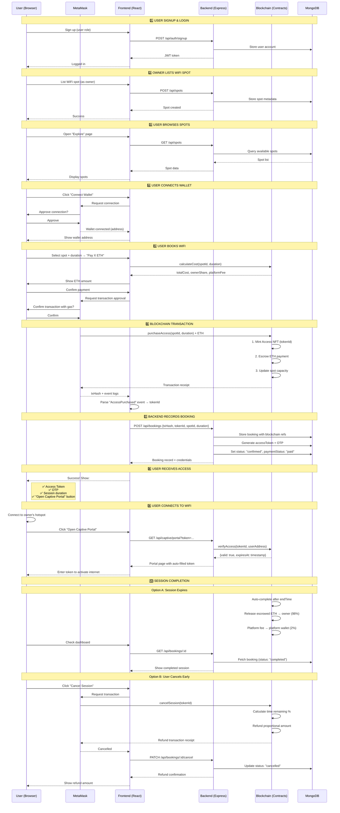
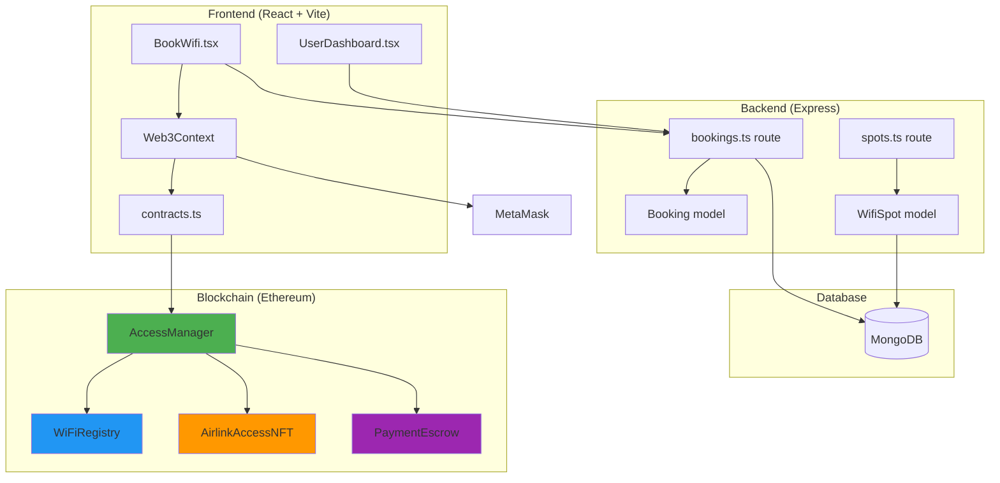
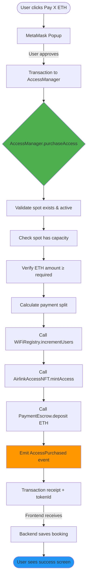

# 🔄 Airlink Web3 — Complete Flow Diagram

## 📋 User Journey: Book WiFi with Blockchain



---

## 🏗️ System Architecture



---

## 🔐 Smart Contract Flow



---

## 📊 Data Flow

### Booking Record (MongoDB)
```json
{
  "_id": "65f3a2b1c4d5e6f7a8b9c0d1",
  "user": "65f3a1a2b3c4d5e6f7a8b9c0",
  "wifiSpot": "65f3a0a1b2c3d4e5f6a7b8c9",
  "owner": "65f3a2b3c4d5e6f7a8b9c0d2",
  
  "startTime": "2026-03-09T10:00:00Z",
  "endTime": "2026-03-09T12:00:00Z",
  "durationHours": 2,
  
  "pricePerHour": 50,
  "subtotal": 100,
  "platformFee": 2,
  "ownerEarnings": 98,
  "totalAmount": 100,
  
  "status": "confirmed",
  "paymentStatus": "paid",
  
  "txHash": "0x1abc2def3456789abc0def123456789abc0def123456789abc0def123456789a",
  "tokenId": 1,
  
  "accessToken": "A1B2C3D4E5F6G7H8",
  "accessTokenOTP": "123456",
  "maxDevices": 1,
  
  "createdAt": "2026-03-09T09:55:00Z",
  "updatedAt": "2026-03-09T10:00:00Z"
}
```

### Smart Contract Session (On-Chain)
```solidity
struct Session {
    uint256 tokenId;           // 1
    uint256 spotId;            // 1
    address user;              // 0xUserAddress
    address spotOwner;         // 0xOwnerAddress
    uint256 totalPaid;         // 0.002 ETH (example)
    uint256 ownerShare;        // 0.00196 ETH (98%)
    uint256 platformFee;       // 0.00004 ETH (2%)
    uint256 startTime;         // 1709982000
    uint256 endTime;           // 1709989200
    SessionStatus status;      // Active / Completed / Cancelled
}
```

### Access Pass NFT (ERC-721)
```solidity
struct AccessPass {
    uint256 spotId;            // 1
    address originalBuyer;     // 0xUserAddress
    uint256 startTime;         // 1709982000
    uint256 expiresAt;         // 1709989200
    uint256 durationHours;     // 2
    bool revoked;              // false
}
```

---

## 🔄 State Transitions

```mermaid
stateDiagram-v2
    [*] --> Pending: User initiates booking
    Pending --> Confirmed: Blockchain tx succeeds + backend records
    Confirmed --> Active: User starts using WiFi
    Active --> Completed: Session expires or manually completed
    Active --> Cancelled: User cancels mid-session
    Confirmed --> Cancelled: User cancels before starting
    
    Completed --> [*]
    Cancelled --> [*]
    
    note right of Confirmed: paymentStatus: "paid"<br/>txHash + tokenId stored
    note right of Active: User connected to WiFi<br/>Portal authenticated
    note right of Completed: Payment released to owner<br/>NFT remains (expired)
    note right of Cancelled: Proportional refund issued<br/>NFT revoked
```

---

## 🎯 Key Integration Points

### 1. Frontend → Blockchain
```typescript
// contracts.ts
export async function bookWifiAccess(
  signer: ethers.Signer,
  spotId: number,
  durationHours: number,
  totalCostWei: bigint
): Promise<{ bookingId: number; txHash: string }> {
  const contract = getManagerContract(signer);
  const tx = await contract.purchaseAccess(spotId, durationHours, 0, {
    value: totalCostWei,
  });
  const receipt = await tx.wait();
  
  // Parse AccessPurchased event for tokenId
  const tokenId = parseEventLog(receipt, "AccessPurchased").tokenId;
  return { bookingId: tokenId, txHash: receipt.hash };
}
```

### 2. Frontend → Backend
```typescript
// After blockchain tx succeeds
const bookingRes = await apiFetch('/api/bookings', {
  method: 'POST',
  body: {
    wifiSpotId: spot._id,
    durationHours: duration,
    txHash: txHash,
    tokenId: tokenId,
  },
  token: authToken,
});
```

### 3. Backend → Database
```typescript
// bookings.ts
const booking = await Booking.create({
  user: req.userId,
  wifiSpot: wifiSpotId,
  owner: spot.owner,
  startTime, endTime, durationHours,
  pricePerHour, subtotal, platformFee, ownerEarnings, totalAmount,
  
  status: "confirmed",
  paymentStatus: "paid",
  
  txHash,     // Blockchain reference
  tokenId,    // NFT ID
  
  accessToken: generateToken(),
  accessTokenOTP: generateOTP(),
});
```

### 4. Captive Portal → Blockchain
```typescript
// Backend verifies access on-chain
const [valid, spotId, expiresAt] = await accessManagerContract.verifyAccess(
  tokenId,
  userAddress
);

if (!valid) {
  throw new Error("Access denied - invalid or expired token");
}
```

---

## ⚡ Quick Start Commands

```bash
# 1. One-command setup
./quick-start.sh

# 2. Start backend (Terminal 1)
cd backend && npm run dev

# 3. Start frontend (Terminal 2)
cd frontend && npm run dev

# 4. Open browser
# http://localhost:5173

# 5. Connect MetaMask
# Network: Hardhat Local (Chain ID: 31337)
# Import account: 0xac0974bec39a17e36ba4a6b4d238ff944bacb478cbed5efcae784d7bf4f2ff80
```

---

## 📚 Documentation Links

- **Setup Guide**: [INTEGRATION_GUIDE.md](./INTEGRATION_GUIDE.md)
- **Architecture**: [WEB3_ARCHITECTURE.md](./WEB3_ARCHITECTURE.md)
- **Smart Contracts**: `blockchain/contracts/`
- **Tests**: `blockchain/test/AirlinkV2.test.ts` (58 passing)

---

**🎉 Ready to test the full Web3 integration!**
