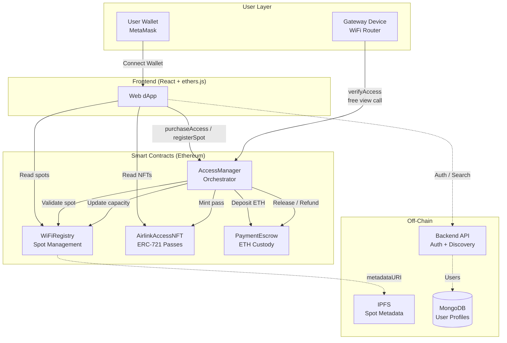
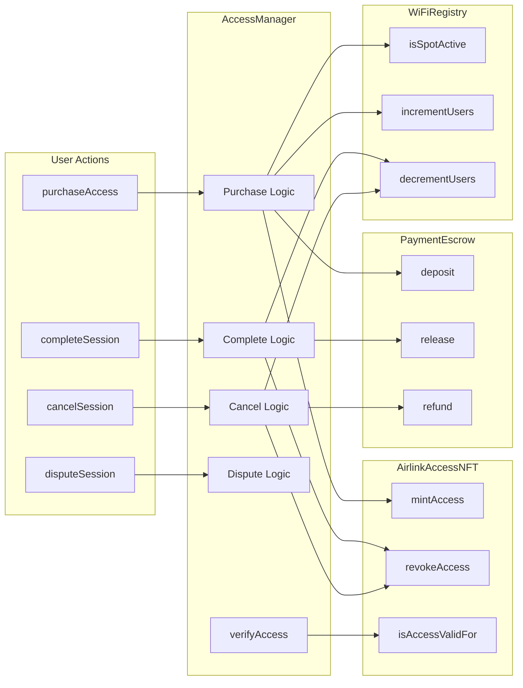
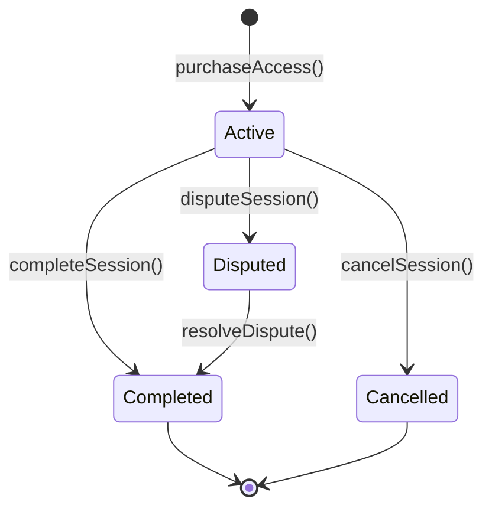
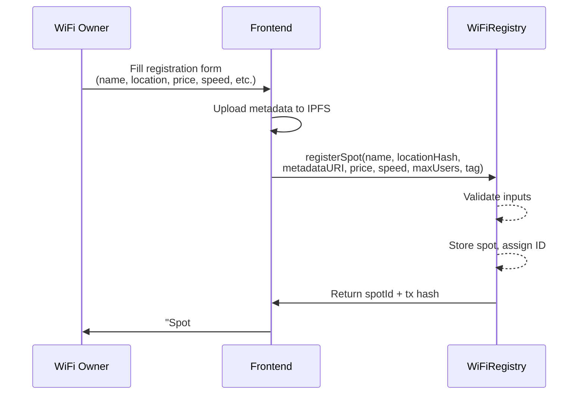
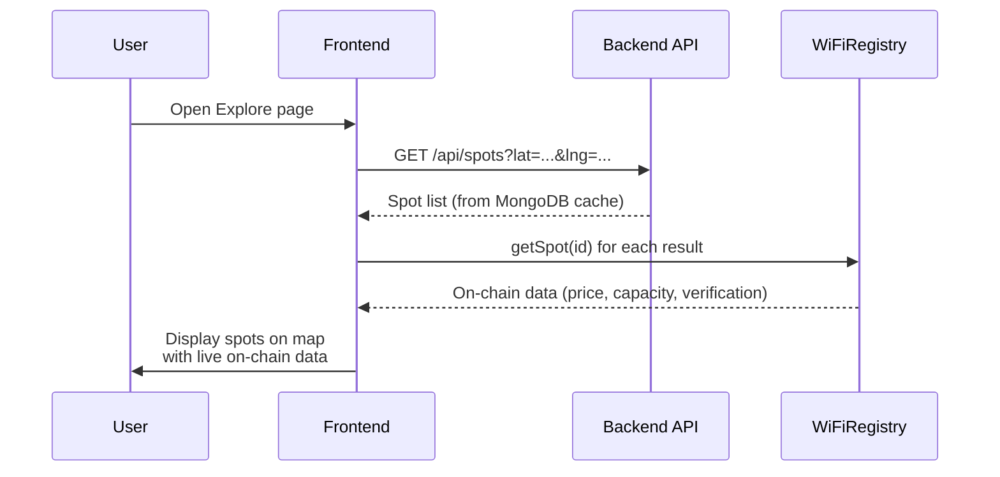
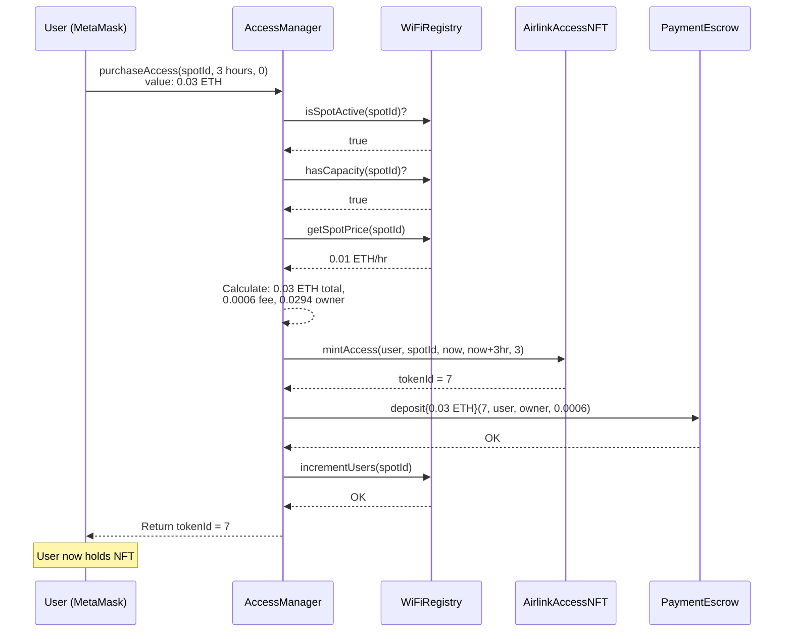
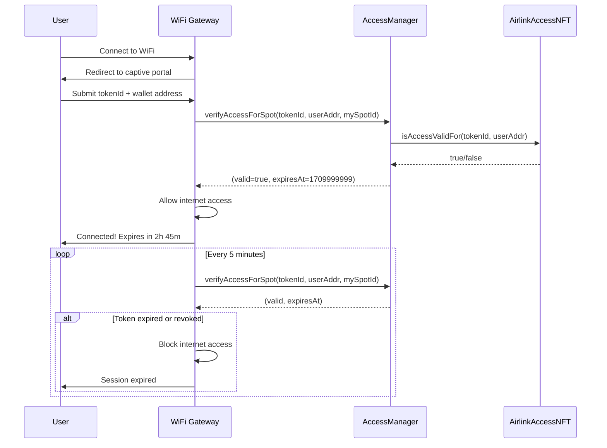
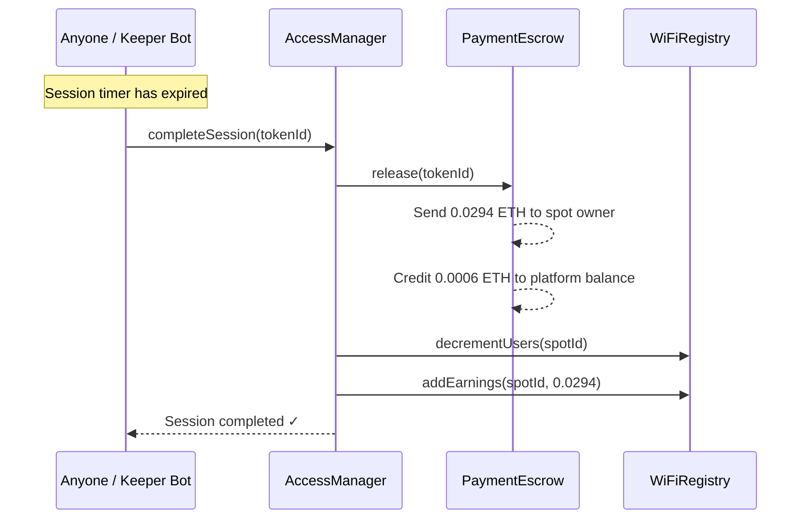
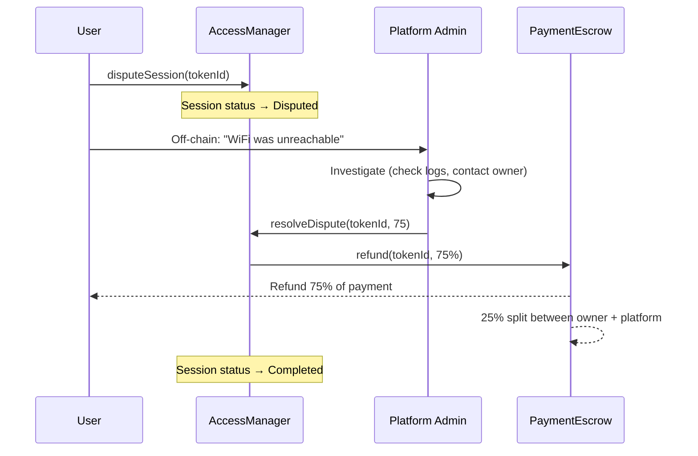

# Airlink Web3 Architecture — Decentralized WiFi Marketplace

> **Version 2.0** — Full Web3 pivot. All payments on-chain via ETH. Access rights as ERC-721 NFTs. Zero centralized payment systems.

---

## Table of Contents

1. [Executive Summary](#1-executive-summary)
2. [Architecture Analysis & Improvements](#2-architecture-analysis--improvements)
3. [System Architecture](#3-system-architecture)
4. [Smart Contract Modules](#4-smart-contract-modules)
5. [Contract Function Reference](#5-contract-function-reference)
6. [Step-by-Step User Flows](#6-step-by-step-user-flows)
7. [Deployment Guide (Hardhat)](#7-deployment-guide-hardhat)
8. [Frontend Integration (ethers.js)](#8-frontend-integration-ethersjs)
9. [Gateway Integration](#9-gateway-integration)
10. [Security Considerations](#10-security-considerations)
11. [Scalability & Future Improvements](#11-scalability--future-improvements)

---

## 1. Executive Summary

Airlink is a decentralized WiFi sharing marketplace where:

- **Hotspot owners** register their WiFi networks and set hourly prices in ETH
- **Users** discover nearby hotspots and pay on-chain for time-limited access
- **Access rights** are minted as ERC-721 NFTs with expiration timestamps
- **Payments** are held in an escrow contract until the session completes
- **Gateway devices** verify access by reading on-chain token state — no backend required
- **Funds** are automatically distributed: 98% to the owner, 2% platform fee

The system is implemented across four modular smart contracts:

| Contract | Purpose |
|---|---|
| **WiFiRegistry** | Hotspot registration, metadata, and capacity tracking |
| **AirlinkAccessNFT** | ERC-721 access passes with on-chain metadata + expiry |
| **PaymentEscrow** | ETH escrow with release/refund logic |
| **AccessManager** | Orchestrator — the single user-facing entry point |

---

## 2. Architecture Analysis & Improvements

### 2.1 Shortcomings of the Original Design

| # | Problem | Impact |
|---|---------|--------|
| 1 | **Monolithic contract** — all logic in one 600+ line contract | Hard to test, audit, and upgrade. Gas-expensive deployments. |
| 2 | **Off-chain access tokens** — only a `keccak256` hash stored on-chain | Gateway must trust backend to generate tokens. Not truly decentralized. |
| 3 | **No token standard** — access rights aren't represented as ERC tokens | Users can't see access passes in wallets. Not composable with DeFi. |
| 4 | **Manual session completion** — someone must call `completeBooking()` | Funds can be locked indefinitely if nobody calls it. |
| 5 | **Flat 50% cancellation refund** — unfair for early or late cancellations | User cancelling 5 min after start gets same refund as 90%. |
| 6 | **No reentrancy protection** — uses checks-effects-interactions but no guard | Potential vulnerability in complex scenarios. |
| 7 | **O(n) active spot count** — `getActiveSpotCount` loops all spots | Gas increases linearly with registered spots. |
| 8 | **Razorpay dependency** — centralized payment gateway in backend routes | Contradicts the decentralized architecture. Single point of failure. |
| 9 | **Platform owner as single dispute resolver** — centralized admin power | Users must trust the platform for fair resolution. |
| 10 | **No on-chain metadata for access tokens** — no visual representation | NFTs don't render in MetaMask, OpenSea, etc. |

### 2.2 Key Improvements in v2

| # | Improvement | Implementation |
|---|-------------|----------------|
| 1 | **Modular contract architecture** | 4 separate contracts with clear responsibilities |
| 2 | **ERC-721 access passes** | Real NFTs with on-chain SVG + JSON metadata |
| 3 | **On-chain gateway verification** | Gateway reads token state directly — no backend needed |
| 4 | **Trustless session finalization** | Anyone can complete expired sessions (keeper pattern) |
| 5 | **Proportional cancellation refunds** | Refund based on remaining session time |
| 6 | **ReentrancyGuard on all ETH paths** | OpenZeppelin's battle-tested protection |
| 7 | **Razorpay completely removed** | All payments are ETH on-chain |
| 8 | **Token composability** | Access passes visible in wallets, tradeable, verifiable |
| 9 | **Separation of concerns** | Registry, Tokens, Payments, and Orchestration are independent |
| 10 | **On-chain SVG rendering** | Access pass NFTs display status, spot info, and expiry visually |

### 2.3 Token Standard Decision: Why ERC-721?

| Standard | Pros | Cons | Verdict |
|----------|------|------|---------|
| **ERC-20** | Simple, fungible | Access passes aren't fungible — each has unique spot/time/expiry | ❌ Wrong fit |
| **ERC-721** | Unique per session, on-chain metadata, wallet-visible, transferable | Slightly higher gas than ERC-1155 | ✅ **Best fit** |
| **ERC-1155** | Multi-token, gas efficient for batches | Over-engineered for 1-of-1 access passes | ❌ Overkill |

Each WiFi access session is inherently unique (specific spot + specific time window), making ERC-721 the natural choice. Users see their active passes as NFTs in MetaMask, and gateways verify ownership on-chain.

---

## 3. System Architecture

### 3.1 High-Level Architecture Diagram



### 3.2 Contract Interaction Diagram



### 3.3 Session Lifecycle State Machine



---

## 4. Smart Contract Modules

### 4.1 WiFiRegistry

**File:** `contracts/WiFiRegistry.sol`

Manages the on-chain registry of WiFi hotspots. Any wallet can register a spot. The platform admin can verify spots after off-chain proof (photos, speed tests, etc.).

**Key design decisions:**
- Spot metadata is stored as an IPFS URI to keep on-chain storage minimal
- Location is stored as a geohash for privacy (not raw lat/lng)
- The `accessManager` address is the only non-owner that can mutate user counts and earnings

### 4.2 AirlinkAccessNFT (ERC-721)

**File:** `contracts/AirlinkAccessNFT.sol`

Each token represents a time-limited WiFi access pass. The token encodes:
- Which spot it grants access to (`spotId`)
- When access begins (`startTime`)
- When access expires (`expiresAt`)
- How long the session is (`durationHours`)

**On-chain metadata:** The contract generates SVG images and JSON metadata entirely on-chain via `tokenURI()`. Users see their passes in MetaMask and OpenSea with the spot number, duration, and live status (Active/Expired/Revoked).

**Revocation:** When a session completes or is cancelled, the NFT is marked as revoked (not burned) so it serves as a permanent receipt.

### 4.3 PaymentEscrow

**File:** `contracts/PaymentEscrow.sol`

Holds ETH during active sessions. The escrow pattern ensures:
- Users can't be scammed (their money is locked, not sent directly to the owner)
- Owners can't lose their payment (it's released automatically on completion)
- Refunds are handled trustlessly (proportional based on remaining time)

**Fund flow:**
```
User pays ETH → Escrow holds it → Session completes → 98% to owner, 2% to platform
                                 → Session cancelled → proportional refund to user
                                 → Dispute resolved → admin-set refund %
```

### 4.4 AccessManager (Orchestrator)

**File:** `contracts/AccessManager.sol`

The single entry point for all user and gateway interactions. It coordinates the other three contracts:

1. **Purchase:** Validates spot → mints NFT → escrows ETH → updates capacity
2. **Verify:** Checks NFT ownership + validity + time window
3. **Complete:** Releases escrow → updates registry → revokes NFT
4. **Cancel:** Calculates proportional refund → refunds via escrow → revokes NFT
5. **Dispute:** Freezes session → platform resolves → refunds via escrow

**Trustless finalization:** Anyone can call `completeSession()` after the session expires. This prevents funds from being locked forever and enables "keeper" bots to finalize sessions automatically.

---

## 5. Contract Function Reference

### WiFiRegistry

| Function | Access | Description |
|----------|--------|-------------|
| `registerSpot(name, locationHash, metadataURI, price, speed, maxUsers, tag)` | Anyone | Register a new WiFi hotspot |
| `updateSpot(spotId, newPrice, newStatus)` | Spot Owner | Update price and status |
| `verifySpot(spotId)` | Platform Admin | Mark spot as verified after off-chain proof |
| `setAccessManager(address)` | Platform Admin | Set the authorized AccessManager |
| `incrementUsers(spotId)` | AccessManager | Increment concurrent user count |
| `decrementUsers(spotId)` | AccessManager | Decrement concurrent user count |
| `addEarnings(spotId, amount)` | AccessManager | Track cumulative earnings |
| `getSpot(spotId)` | View | Get full spot details |
| `getOwnerSpots(owner)` | View | Get all spot IDs for an owner |
| `isSpotActive(spotId)` | View | Check if spot is active |
| `hasCapacity(spotId)` | View | Check if spot has available slots |

### AirlinkAccessNFT

| Function | Access | Description |
|----------|--------|-------------|
| `mintAccess(to, spotId, startTime, expiresAt, durationHours)` | AccessManager | Mint a new access pass NFT |
| `revokeAccess(tokenId)` | AccessManager | Mark a pass as revoked |
| `isAccessValid(tokenId)` | View | Check if a token is valid (exists + not revoked + in time window) |
| `isAccessValidFor(tokenId, user)` | View | Check validity for a specific user (adds ownership check) |
| `getAccessPass(tokenId)` | View | Get pass details |
| `tokenURI(tokenId)` | View | On-chain SVG + JSON metadata |

### PaymentEscrow

| Function | Access | Description |
|----------|--------|-------------|
| `deposit(tokenId, payer, recipient, platformFee)` | AccessManager | Accept ETH deposit for a session |
| `release(tokenId)` | AccessManager | Release funds to spot owner + credit platform fee |
| `refund(tokenId, refundPercent)` | AccessManager | Refund user (0-100%), distribute remainder |
| `withdrawPlatformFees()` | Platform Admin | Withdraw accumulated platform fees |
| `getDeposit(tokenId)` | View | Get deposit details |

### AccessManager

| Function | Access | Description |
|----------|--------|-------------|
| `purchaseAccess(spotId, durationHours, startTime)` | Anyone (payable) | Buy WiFi access — mints NFT + escrows ETH |
| `verifyAccess(tokenId, user)` | View | Gateway verification — returns (valid, spotId, expiresAt) |
| `verifyAccessForSpot(tokenId, user, spotId)` | View | Gateway verification for a specific spot |
| `completeSession(tokenId)` | User/Owner/Admin/Anyone(expired) | Release escrow to owner |
| `cancelSession(tokenId)` | User/Admin | Proportional refund based on remaining time |
| `disputeSession(tokenId)` | Session User | Raise a dispute |
| `resolveDispute(tokenId, refundPercent)` | Platform Admin | Resolve dispute with refund % |
| `calculateCost(spotId, durationHours)` | View | Preview cost breakdown |
| `getSession(tokenId)` | View | Get session details |
| `getUserSessions(user)` | View | Get all session IDs for a user |

---

## 6. Step-by-Step User Flows

### 6.1 Hotspot Registration



**No admin approval needed to register.** The platform admin can optionally verify spots for a "verified" badge.

### 6.2 Hotspot Discovery



**Hybrid approach:** The backend caches spot metadata for fast search/filtering. Pricing and availability are always read from the blockchain for accuracy.

### 6.3 User Payment & Token Issuance



### 6.4 Gateway Verification



**Key insight:** The gateway only makes view calls (free, no gas). It reads the blockchain directly — no backend trust required.

### 6.5 Session Completion



### 6.6 Cancellation & Refund

```
Timing-based refund calculation:

 Session: |====== 3 hours total ======|
 Cancel:       ↑ (after 1 hour)
 Elapsed: |====| 1hr = 33%
 Remaining:    |================| 2hr = 67%
 Refund: 67% of 0.03 ETH = 0.0201 ETH
 Owner receives: 33% minus platform fee
```

### 6.7 Dispute Resolution



---

## 7. Deployment Guide (Hardhat)

### 7.1 Prerequisites

```bash
cd blockchain
npm install
```

The project uses:
- Hardhat with `@nomicfoundation/hardhat-toolbox`
- OpenZeppelin Contracts v5+
- dotenv for environment variables

### 7.2 Compile Contracts

```bash
npx hardhat compile
```

### 7.3 Run Tests

```bash
npx hardhat test
```

### 7.4 Deploy to Local Network

**Terminal 1 — Start local node:**
```bash
npx hardhat node
```

**Terminal 2 — Deploy:**
```bash
npx hardhat run scripts/deploy.ts --network localhost
```

### 7.5 Deploy to Sepolia Testnet

Create a `.env` file:
```env
SEPOLIA_RPC_URL=https://eth-sepolia.g.alchemy.com/v2/YOUR_KEY
DEPLOYER_PRIVATE_KEY=0xYOUR_PRIVATE_KEY
```

Deploy:
```bash
npx hardhat run scripts/deploy.ts --network sepolia
```

### 7.6 Deployment Script Overview

The `scripts/deploy.ts` deploys all four contracts in order and links them:

1. Deploy `WiFiRegistry`
2. Deploy `AirlinkAccessNFT`
3. Deploy `PaymentEscrow`
4. Deploy `AccessManager(registry, nft, escrow)`
5. Call `registry.setAccessManager(accessManager)`
6. Call `nft.setAccessManager(accessManager)`
7. Call `escrow.setAccessManager(accessManager)`

---

## 8. Frontend Integration (ethers.js)

### 8.1 Contract Setup

```typescript
import { BrowserProvider, Contract, ethers, parseEther, formatEther } from "ethers";

// Contract addresses (update after deployment)
export const ADDRESSES = {
  registry: "0x...",
  accessNFT: "0x...",
  escrow: "0x...",
  accessManager: "0x...",
};

// Human-readable ABIs (only functions we call)
export const ACCESS_MANAGER_ABI = [
  "function purchaseAccess(uint256 spotId, uint256 durationHours, uint256 startTime) external payable returns (uint256)",
  "function verifyAccess(uint256 tokenId, address user) external view returns (bool valid, uint256 spotId, uint256 expiresAt)",
  "function completeSession(uint256 tokenId) external",
  "function cancelSession(uint256 tokenId) external",
  "function disputeSession(uint256 tokenId) external",
  "function calculateCost(uint256 spotId, uint256 durationHours) external view returns (uint256 total, uint256 ownerShare, uint256 fee)",
  "function getSession(uint256 tokenId) external view returns (tuple(uint256 tokenId, uint256 spotId, address user, address spotOwner, uint256 totalPaid, uint256 ownerShare, uint256 platformFee, uint256 startTime, uint256 endTime, uint8 status))",
  "function getUserSessions(address user) external view returns (uint256[])",
  "event AccessPurchased(uint256 indexed tokenId, uint256 indexed spotId, address indexed user, uint256 totalPaid, uint256 startTime, uint256 endTime)",
];

export const REGISTRY_ABI = [
  "function registerSpot(string name, string locationHash, string metadataURI, uint256 pricePerHourWei, uint256 speedMbps, uint8 maxUsers, uint8 tag) external returns (uint256)",
  "function getSpot(uint256 spotId) external view returns (tuple(uint256 id, address owner, string name, string locationHash, string metadataURI, uint256 pricePerHourWei, uint256 speedMbps, uint8 maxUsers, uint8 currentUsers, uint8 tag, uint8 status, bool isVerified, uint256 totalEarnings, uint256 totalBookings, uint256 registeredAt))",
  "function getOwnerSpots(address owner) external view returns (uint256[])",
  "function isSpotActive(uint256 spotId) external view returns (bool)",
];

export const ACCESS_NFT_ABI = [
  "function isAccessValid(uint256 tokenId) external view returns (bool)",
  "function getAccessPass(uint256 tokenId) external view returns (tuple(uint256 spotId, address originalBuyer, uint256 startTime, uint256 expiresAt, uint256 durationHours, bool revoked))",
  "function tokenURI(uint256 tokenId) external view returns (string)",
  "function balanceOf(address owner) external view returns (uint256)",
];
```

### 8.2 Purchase WiFi Access

```typescript
async function purchaseAccess(spotId: number, durationHours: number) {
  const provider = new BrowserProvider(window.ethereum);
  const signer = await provider.getSigner();

  const manager = new Contract(ADDRESSES.accessManager, ACCESS_MANAGER_ABI, signer);

  // 1. Preview cost
  const [total, ownerShare, fee] = await manager.calculateCost(spotId, durationHours);
  console.log(`Total: ${formatEther(total)} ETH (Owner: ${formatEther(ownerShare)}, Fee: ${formatEther(fee)})`);

  // 2. Send transaction (value = total cost)
  const tx = await manager.purchaseAccess(spotId, durationHours, 0, { value: total });
  const receipt = await tx.wait();

  // 3. Parse event to get tokenId
  const iface = new ethers.Interface(ACCESS_MANAGER_ABI);
  for (const log of receipt.logs) {
    try {
      const parsed = iface.parseLog({ topics: log.topics, data: log.data });
      if (parsed?.name === "AccessPurchased") {
        return {
          tokenId: Number(parsed.args.tokenId),
          txHash: receipt.hash,
        };
      }
    } catch { /* skip non-matching logs */ }
  }
}
```

### 8.3 Verify Access (Gateway)

```typescript
async function checkAccess(tokenId: number, userAddress: string) {
  const provider = new BrowserProvider(window.ethereum);
  const manager = new Contract(ADDRESSES.accessManager, ACCESS_MANAGER_ABI, provider);

  const [valid, spotId, expiresAt] = await manager.verifyAccess(tokenId, userAddress);
  return {
    valid,
    spotId: Number(spotId),
    expiresAt: new Date(Number(expiresAt) * 1000),
  };
}
```

---

## 9. Gateway Integration

The gateway (WiFi router) runs a Node.js process that verifies access on-chain:

```javascript
const { ethers } = require("ethers");

// Connect to Ethereum (Infura, Alchemy, or local node)
const provider = new ethers.JsonRpcProvider(process.env.RPC_URL);
const manager = new ethers.Contract(ACCESS_MANAGER_ADDRESS, ACCESS_MANAGER_ABI, provider);

const MY_SPOT_ID = parseInt(process.env.SPOT_ID);

async function verifyUser(tokenId, userAddress) {
  const [valid, expiresAt] = await manager.verifyAccessForSpot(tokenId, userAddress, MY_SPOT_ID);
  return { valid, expiresAt: Number(expiresAt) };
}

// Called when user submits credentials via captive portal
app.post("/auth", async (req, res) => {
  const { tokenId, walletAddress } = req.body;
  const { valid, expiresAt } = await verifyUser(tokenId, walletAddress);

  if (valid) {
    allowInternetAccess(walletAddress);  // iptables / nftables rule
    scheduleExpiry(walletAddress, expiresAt);
    res.json({ success: true, expiresAt });
  } else {
    res.json({ success: false, message: "Invalid or expired access token" });
  }
});
```

**No private keys needed on the gateway** — it only makes read-only calls.

---

## 10. Security Considerations

### 10.1 Smart Contract Security

| Concern | Mitigation |
|---------|------------|
| **Reentrancy attacks** | `ReentrancyGuard` on all functions with external ETH calls |
| **Integer overflow** | Solidity 0.8+ has built-in overflow protection |
| **Access control** | `onlyOwner`, `onlyManager`, `onlySpotOwner` modifiers |
| **Front-running** | Purchase price is deterministic (price × hours). No slippage to exploit. |
| **Denial of service** | No unbounded loops. Spot iteration removed. |
| **Locked funds** | Anyone can finalize expired sessions — no funds locked forever |
| **Flash loan attacks** | Payments are direct ETH — no oracle or price manipulation |
| **ETH transfer failures** | Uses `call{value}` with require. Follows pull pattern for platform fees. |

### 10.2 Contract Upgrade Path

The contracts are **not** upgradeable (simpler, safer for hackathon). For production:
- Use OpenZeppelin's `TransparentUpgradeableProxy`
- Or deploy new contracts and migrate data via events

### 10.3 Access Control Matrix

| Function | User | Spot Owner | Platform Admin | AccessManager | Anyone |
|----------|------|------------|----------------|---------------|--------|
| registerSpot | ✅ | ✅ | ✅ | — | ✅ |
| purchaseAccess | ✅ | — | — | — | ✅ |
| completeSession | ✅ | ✅ | ✅ | — | ✅(expired) |
| cancelSession | ✅ | — | ✅ | — | — |
| disputeSession | ✅ | — | — | — | — |
| resolveDispute | — | — | ✅ | — | — |
| verifyAccess | — | — | — | — | ✅(view) |
| mintAccess | — | — | — | ✅ | — |
| deposit/release/refund | — | — | — | ✅ | — |

### 10.4 Gateway Security

- The gateway only uses view calls (no private key exposure)
- Token validation happens on-chain (can't be spoofed)
- Periodic re-verification catches expired/revoked tokens
- User presents both `tokenId` and wallet address (must match NFT owner)

---

## 11. Scalability & Future Improvements

### 11.1 Layer 2 Scaling

| Approach | Benefit | Complexity |
|----------|---------|------------|
| **Deploy on Base/Arbitrum** | Sub-cent gas fees, instant finality | Low — same Solidity, just change RPC |
| **Polygon PoS** | Established ecosystem, MATIC for gas | Low |
| **Optimism** | EVM equivalent, good ethers.js support | Low |

**Recommendation:** Deploy on **Base** (Coinbase L2) for lowest gas fees while maintaining Ethereum security.

### 11.2 Feature Roadmap

| Feature | Description |
|---------|-------------|
| **Subscription passes** | Monthly/weekly passes for regular spots (batch minting) |
| **Reputation system** | On-chain ratings for spots and users |
| **DAO governance** | Token holders vote on platform fee % and dispute resolution |
| **Automated keepers** | Chainlink Keepers auto-finalize expired sessions |
| **Multi-chain** | Deploy on multiple L2s with cross-chain messaging |
| **Bandwidth metering** | Pay-per-MB using oracles to report actual usage |
| **Transferable passes** | Allow users to resell or gift unused access passes |
| **Dynamic pricing** | Spots can adjust pricing based on demand (time-of-day curves) |
| **Staking for owners** | Owners stake ETH as a quality guarantee (slashed on disputes) |

### 11.3 Gas Optimization Ideas

- **Batch operations:** Allow purchasing multiple spots in one transaction
- **ERC-721A:** Use Azuki's gas-optimized ERC-721 for cheaper batch mints
- **Storage packing:** Pack struct fields into fewer storage slots
- **Event-based indexing:** Use The Graph for querying instead of on-chain mappings

---

## Appendix: Contract Deployment Addresses

| Network | WiFiRegistry | AirlinkAccessNFT | PaymentEscrow | AccessManager |
|---------|-------------|-------------------|---------------|---------------|
| Hardhat Local | *deploy locally* | *deploy locally* | *deploy locally* | *deploy locally* |
| Sepolia | TBD | TBD | TBD | TBD |
| Base | TBD | TBD | TBD | TBD |

> Update these after each deployment using the output from `scripts/deploy.ts`.
