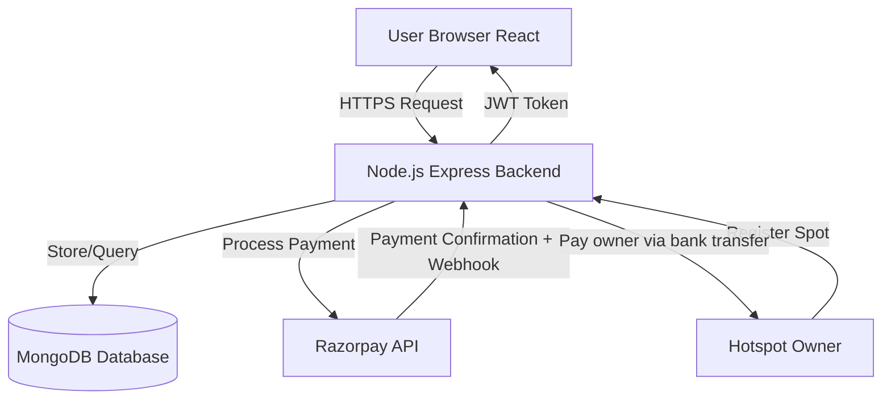
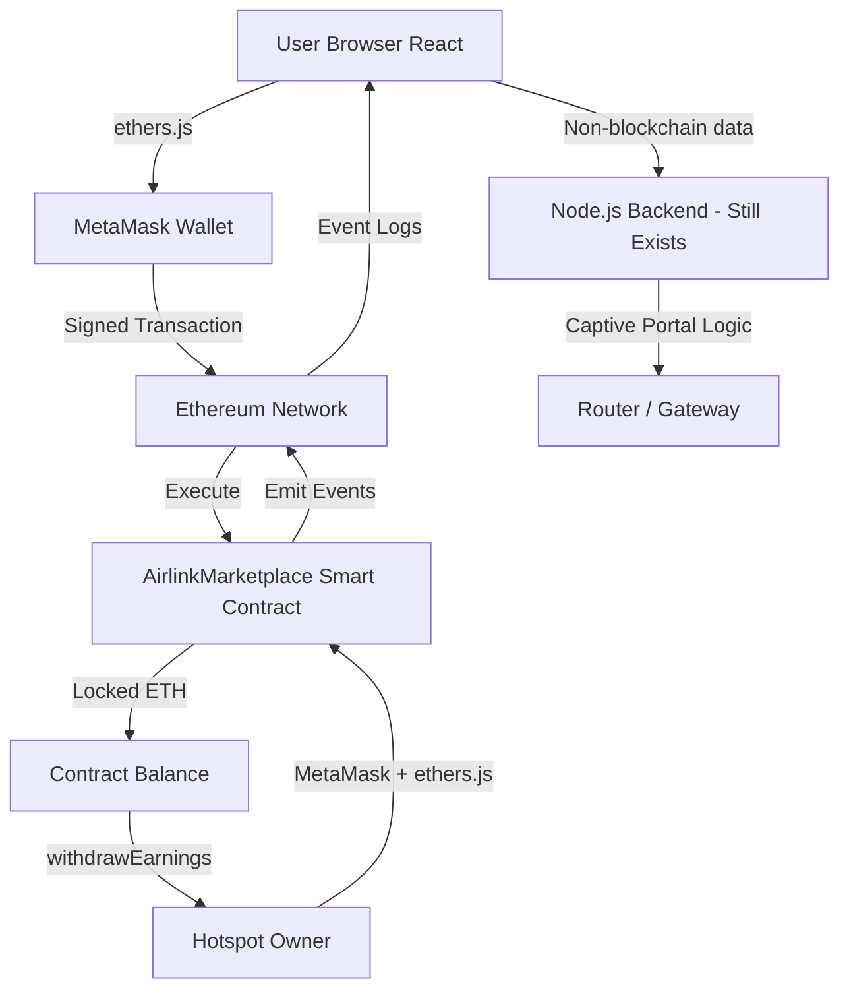
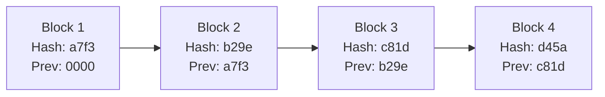
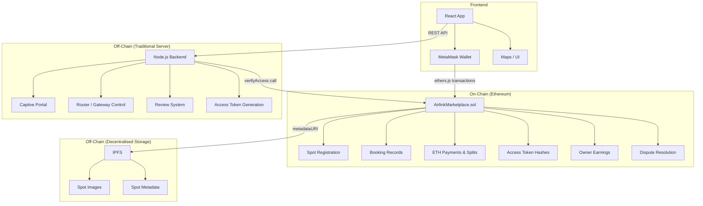
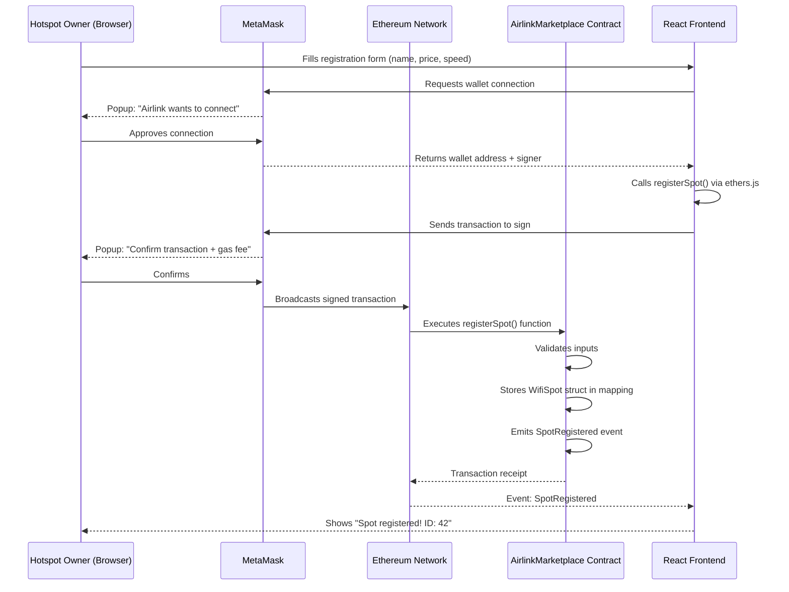
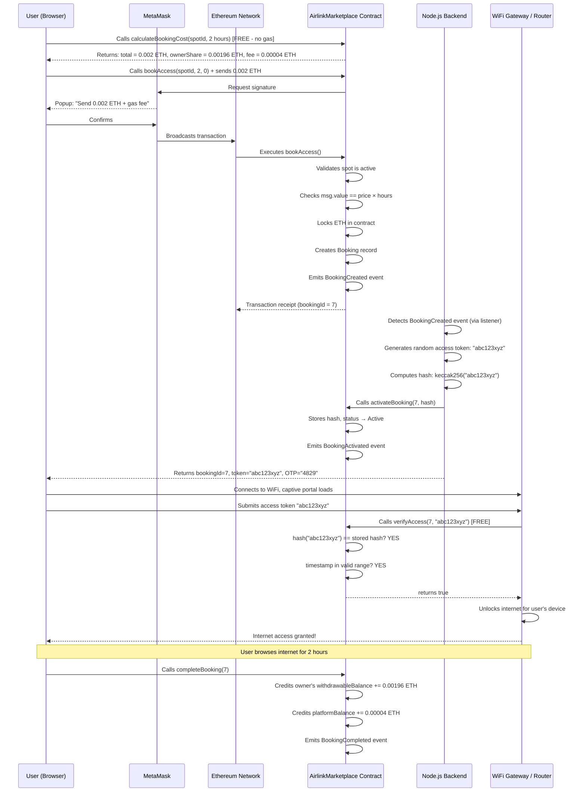

# Airlink — Web3 Project Explanation
### A Complete Guide for Hackathon Demos (Written for a Total Beginner)

> **How to use this document:** Read it top to bottom once before the demo. Everything escalates from "zero knowledge" to "technically confident". The judge Q&A section at the end is your cheat sheet.

---

## Table of Contents

1. [Project Overview](#1-project-overview)
2. [Web2 vs Web3 Comparison](#2-web2-vs-web3-comparison)
3. [Blockchain Fundamentals](#3-blockchain-fundamentals)
4. [Ethereum Overview](#4-ethereum-overview)
5. [Smart Contracts](#5-smart-contracts)
6. [Where Blockchain Is Used In Our Project](#6-where-blockchain-is-used-in-our-project)
7. [File Changes In The Project](#7-file-changes-in-the-project)
8. [Smart Contract Deep Dive](#8-smart-contract-deep-dive)
9. [Deployment Guide](#9-deployment-guide)
10. [Frontend Integration](#10-frontend-integration)
11. [Data Flow of the System](#11-data-flow-of-the-system)
12. [Security Considerations](#12-security-considerations)
13. [Hackathon Judge Questions & Answers](#13-hackathon-judge-questions--answers)
14. [Simple Summary](#14-simple-summary)

---

## 1. Project Overview

### What Is Airlink?

Airlink is a **decentralized WiFi sharing marketplace**.

Think of it like **Airbnb — but for internet access instead of rooms**.

- A **homeowner or café owner** who has good internet can register their WiFi hotspot on the platform.
- A **traveller or visitor** who needs internet can discover nearby hotspots, pay a small fee, and get temporary WiFi access.
- The **hotspot owner earns money** passively just for sharing their existing internet connection.

### The Core Problem We Solve

Right now, if you're in an unfamiliar area and need internet:
- Coffee shop WiFi is free but unreliable and technically shared with 50 strangers.
- Mobile data is expensive.
- Public WiFi is insecure.

There is no fair marketplace where private individuals can monetize their unused bandwidth.

### Why Blockchain?

In the original Web2 version, Airlink used a central database (MongoDB) and Razorpay to process payments. This introduces three problems:

| Problem | Explanation |
|---|---|
| **Trust** | The platform controls all money. Owners must trust that Airlink will pay them correctly. |
| **Fraud** | A user could claim they paid when they didn't. A dishonest platform could keep money. |
| **Single point of failure** | If the Airlink server goes down, no payments go through. |

With **blockchain**, these problems are solved automatically:

- Payments go directly into the smart contract — Airlink cannot touch owner money unless it was legitimately earned.
- Every transaction is recorded permanently on a public ledger — nothing can be faked.
- The rules (pricing, fee splits, refunds) are written in code and executed automatically — no human in the middle.

---

## 2. Web2 vs Web3 Comparison

### How It Worked Before (Web2)

```
User pays with card
       ↓
Razorpay processes payment
       ↓
Airlink backend receives confirmation
       ↓
Airlink backend stores booking in MongoDB
       ↓
Airlink backend decides to pay the hotspot owner
       ↓
Owner receives money (after platform takes cut)
```

**The user must trust:**
- Razorpay to process the payment honestly
- The Airlink backend to honour the booking
- Airlink to correctly distribute earnings

### How It Works Now (Web3)

```
User sends ETH directly to smart contract
       ↓
Smart contract automatically validates the booking
       ↓
ETH is locked inside the contract (nobody can touch it)
       ↓
Session completes → contract automatically splits:
  • 98% → hotspot owner's withdrawable balance
  • 2%  → platform fee address
       ↓
Owner calls withdrawEarnings() to claim their ETH
```

**Nobody needs to trust anyone** — the code is law, and the code is public.

### Side-by-Side Architecture Comparison

**Web2 Architecture:**



**Web3 Architecture:**



### What Changed, What Stayed

| Component | Web2 | Web3 |
|---|---|---|
| User authentication | JWT tokens | Ethereum wallet address |
| Payments | Razorpay (credit card) | ETH via MetaMask |
| Booking records | MongoDB | Smart contract on-chain |
| Hotspot ownership | MongoDB document | On-chain mapping (address → spot) |
| Fee splitting | Backend calculates and pays | Contract splits automatically |
| Revenue transparency | Trust Airlink's word | Publicly verifiable on-chain |
| WiFi router control | Node.js gateway (unchanged) | Node.js gateway (unchanged) |
| Frontend UI | React (unchanged) | React + ethers.js added |

---

## 3. Blockchain Fundamentals

### What Is a Blockchain? (The Simple Version)

Imagine you and your friends maintain a shared notebook. Every time money changes hands, everyone writes the same entry in their own copy of the notebook. If anyone tries to change their entry, the others immediately notice because their copies don't match.

That shared notebook is a **blockchain**. Except instead of friends, there are thousands of computers around the world, and instead of a notebook, it's a digital ledger.

### What Is a Block?

A **block** is a bundle of recent transactions grouped together. Think of it like one page in that notebook.

Each block contains:
- A list of transactions (e.g., "Alice paid Bob 0.5 ETH")
- A timestamp
- A reference to the previous block (the "hash")
- Its own unique fingerprint (its own "hash")

### What Is a Hash?

A **hash** is a unique fingerprint for data.

Think of hashing as a magic blender:
- You put data in (a whole paragraph of text, a number, anything)
- It always outputs a fixed-length string of letters and numbers
- Even a tiny change to the input (like changing one letter) produces a completely different output
- You cannot reverse it — you cannot go from the output back to the input

Example:
```
Input:  "Alice paid Bob 1 ETH"
Output: "a7f3c2d8e1b4..."   ← 64 character string

Input:  "Alice paid Bob 2 ETH"  ← changed just the amount
Output: "9b2e7f1c4a88..."   ← completely different string
```

In a blockchain, each block contains the hash of the previous block. This creates a chain. If you change anything in block #5, its hash changes. Now block #6's reference to block #5 is wrong. And block #7's reference is wrong. **The entire chain after the change becomes invalid.** This is why blockchains are tamper-proof.



If someone tampers with Block 2, its hash changes to something other than `b29e`, and Block 3's `Prev` field no longer matches. The chain is broken and everyone can see the fraud immediately.

### What Is a Distributed Network?

The blockchain is not stored on one server — it is stored on **thousands of computers (called nodes) simultaneously around the world**.

- When a new transaction happens, it is broadcast to all nodes.
- All nodes verify the transaction.
- Once enough nodes agree it is valid, it is added to the blockchain.
- There is no single company, server, or country that controls it.

This is called **decentralisation**. To cheat the system, you would need to control more than 50% of all nodes simultaneously — which is practically impossible.

### What Is Immutability?

**Immutable** means it cannot be changed after the fact.

Once a transaction is confirmed on the blockchain, it is:
- Permanent (cannot be deleted)
- Uneditable (cannot be modified)
- Publicly visible (anyone can verify it)
- Globally replicated (stored on thousands of machines)

In our project, this means: once a booking is created and ETH is sent to the contract, that record exists forever. Airlink cannot pretend a booking never happened.

### Why Is Blockchain Trusted?

| Property | What It Means | Why It Matters for Airlink |
|---|---|---|
| **Decentralised** | No single point of control | Airlink cannot secretly alter records |
| **Transparent** | All transactions are public | Anyone can verify payments happened |
| **Immutable** | Records cannot be changed | Booking history is permanent |
| **Trustless** | Rules run as code, not by humans | No need to trust Airlink the company |
| **Permissionless** | Anyone can join or transact | No signups needed — just a wallet |

---

## 4. Ethereum Overview

### What Is Ethereum?

If Bitcoin is a calculator (it only does one thing: track who owns which coin), **Ethereum is a computer** (it can run programs).

Ethereum is a worldwide network of computers that can execute code. That code runs in a special environment called the **Ethereum Virtual Machine (EVM)**.

The programs that run on Ethereum are called **smart contracts** (explained in the next section).

The native currency of Ethereum is **Ether (ETH)**. It is used to:
- Pay for transactions
- Pay for computation
- Send value between people

### What Is a Wallet?

In the physical world, a wallet holds your money. In Ethereum, a wallet is a piece of software that manages your **private key** — a secret code that proves you own your Ethereum address.

Your wallet does two things:
1. **Holds your address** — a public identifier like `0x742d35Cc...` (like your account number)
2. **Signs transactions** — uses your private key to authorise transfers (like your PIN or signature)

**MetaMask** is the most popular Ethereum wallet. It is a browser extension. In our project, users connect MetaMask to Airlink to make payments.

> Important: Your wallet address is public. Your private key must NEVER be shared. Whoever has your private key controls your wallet completely.

### What Is an Ethereum Transaction?

A **transaction** is any action you take on the blockchain that changes state:
- Sending ETH from A to B
- Calling a function in a smart contract

Every transaction:
- Must be signed with your private key
- Costs a small fee called **gas**
- Is broadcast to the entire network
- Gets confirmed within seconds to minutes (depending on network congestion)
- Is permanently recorded

### What Are Gas Fees?

**Gas** is the unit that measures how much computation a transaction requires.

Think of it like petrol in a car:
- A simple ETH transfer uses a small amount of gas (small tank)
- A complex smart contract call uses more gas (bigger tank)

You multiply gas used × gas price (in Gwei, a tiny unit of ETH) to get the fee.

```
Fee = Gas Used × Gas Price
```

Gas prices fluctuate with network demand. When many people are using Ethereum, fees go up. At quiet times, they are very low.

In our project, when a user books WiFi access:
- They pay the WiFi cost (to the smart contract)
- Plus a small gas fee (to the Ethereum network)

Gas does NOT go to Airlink. It goes to the node that validated the transaction.

### What Are Nodes?

A **node** is a computer running the Ethereum client software. Nodes:
- Store a copy of the entire blockchain
- Validate new transactions
- Propagate information to other nodes
- Execute smart contract code

There are tens of thousands of nodes. Together, they form the Ethereum network. No one controls them all.

### What Is a Testnet?

Before deploying to the real Ethereum network (which uses real money), developers use **testnets** — identical copies of Ethereum that use fake ETH.

We use the **Sepolia testnet** for our hackathon demo. Everything works exactly the same, but the ETH is free (obtained from faucets) and has no real-world value.

---

## 5. Smart Contracts

### What Is a Smart Contract?

A **smart contract** is a program that lives on the blockchain.

Simple analogy: a vending machine.

A vending machine has rules baked in:
- If you insert £1 and press B3, you get a snack.
- If you insert 50p, you get nothing (and 50p back).
- The machine doesn't care who you are. It just follows the rules.
- The machine owner cannot reach in and change what you get after you've paid.

A smart contract works the same way:
- You define the rules in code (using a language called **Solidity**)
- Once deployed, the rules execute automatically
- Nobody — not even the contract creator — can change the execution once it has started

### What Language Are Smart Contracts Written In?

**Solidity** is the most popular language for Ethereum smart contracts. It looks like a mix of JavaScript and C++.

```solidity
// Very simple example
contract VendingMachine {
    function buySnack() public payable {
        require(msg.value >= 0.001 ether, "Not enough ETH");
        // Snack is handed out automatically
    }
}
```

- `public` — this function can be called by anyone
- `payable` — this function accepts ETH
- `msg.value` — the amount of ETH sent with the call
- `require(...)` — if the condition is false, the transaction is rejected and ETH is returned

### How Is a Smart Contract Deployed?

1. Write the contract in Solidity (`.sol` file)
2. **Compile** it — converts Solidity code into bytecode the EVM can run
3. **Deploy** it — send a special transaction containing the bytecode to the Ethereum network
4. The network assigns it a **contract address** (like `0xAbCd1234...`)
5. Anyone can now call functions on the contract by sending transactions to that address

### Why Smart Contracts Are Used In Our Project

| Task | Without Smart Contracts | With Smart Contracts |
|---|---|---|
| Collecting payment | Razorpay → backend → maybe pay owner | User pays contract → contract holds ETH automatically |
| Fee splitting | Backend code calculates and transfers | Contract splits 98/2 instantly, atomically |
| Booking records | MongoDB (can be edited by admin) | On-chain (immutable, public) |
| Ownership proof | Database says "user X owns spot Y" | Blockchain says "address 0x... owns spot #3" |
| Refunds | Admin reviews and manually initiates | Contract refunds automatically based on timing |

### How Smart Contracts Replace Backend Logic

In Web2, the backend was responsible for:
- Validating payments before confirming a booking
- Calculating the 98% / 2% split
- Storing bookings in MongoDB
- Deciding whether to issue a refund

In Web3, **the smart contract does all of this**. The backend still exists for things the blockchain cannot do (router control, captive portal, maps) but the financial logic has moved entirely on-chain.

---

## 6. Where Blockchain Is Used In Our Project

### What Moved On-Chain (Blockchain)

#### Hotspot Registration
Before: Owner fills in a form → backend stores spot details in MongoDB.

Now: Owner calls `registerSpot()` on the smart contract via MetaMask. The contract stores:
- Owner's Ethereum address (cryptographic proof of ownership)
- Spot name, price per hour in ETH, speed, maximum users
- Location hash (a hashed/obfuscated reference — keeps exact coordinates private)
- Metadata URI pointing to an IPFS document with photos and description

**Why on-chain?** The link between the owner's Ethereum address and their spot is now cryptographic. It cannot be forged or altered by anyone.

#### Hotspot Ownership Verification
The platform (Airlink admin) can call `verifySpot()` after checking proof off-chain (router screenshot, photos). This sets an on-chain `isVerified = true` flag.

**Why on-chain?** Users can query the verified flag directly from the blockchain. They don't have to trust Airlink's dashboard — they can verify it independently.

#### Booking Creation and Payment
Before: User pays Razorpay → webhook → backend confirms booking in MongoDB.

Now: User calls `bookAccess(spotId, durationHours, startTime)` and sends ETH equal to `pricePerHour × durationHours`. The contract:
1. Validates the spot is active
2. Checks the user isn't booking their own spot
3. Verifies the exact ETH amount is sent
4. Calculates the 98% owner share and 2% platform fee
5. Locks the ETH in the contract
6. Creates a booking record on-chain
7. Emits a `BookingCreated` event

**Why on-chain?** The payment and the booking record are created atomically in a single transaction. There is no "payment succeeded but booking failed" scenario.

#### Access Token Verification
After payment, the platform generates an access token off-chain and stores only its **cryptographic hash** (`keccak256`) on-chain via `activateBooking()`.

When the captive portal needs to grant internet access, it calls `verifyAccess(bookingId, token)`. The contract hashes the token and compares it to the stored hash. No token is ever stored in plaintext on-chain.

**Why on-chain?** The gateway can verify access trustlessly — no database call needed, no backend required.

#### Earnings and Withdrawals
Owner earnings are tracked on-chain per booking. When the session completes, the smart contract credits the owner's `withdrawableBalance`. The owner can call `withdrawEarnings()` at any time and ETH is transferred directly to their wallet — Airlink never touches it.

**Why on-chain?** Complete financial transparency. The owner can verify their balance at any moment using any Ethereum block explorer. Airlink cannot withhold payments.

#### Dispute Resolution
If a user's WiFi session didn't work, they can call `disputeBooking()`. The dispute is recorded on-chain. The platform then resolves it off-chain (review, evidence) and calls `resolveDispute(bookingId, refundPercent)` to distribute the ETH fairly.

---

### What Stayed Off-Chain (Traditional Backend + Infrastructure)

| Component | Why It Stays Off-Chain |
|---|---|
| **Router / Gateway Control** | Physical hardware — a Solidity contract cannot flip a network switch. The Node.js gateway still controls MAC/IP based internet access. |
| **WiFi Bandwidth Management** | Traffic shaping and QoS happen at the network layer, not the blockchain layer. |
| **Captive Portal** | The web page users see when they first connect to the WiFi is served by the Node.js backend. It uses the access token to call the smart contract for verification, then unlocks internet. |
| **Frontend UI** | React handles the user interface, maps (with spot locations), and visual components. |
| **Maps & Geolocation** | Precise GPS coordinates are stored off-chain for privacy. Only an obfuscated hash is stored on-chain. |
| **User Reviews** | Still in MongoDB — reviews are non-financial social data, not worth the gas cost of storing on-chain. |
| **Spot Images & Descriptions** | Stored in IPFS (a decentralised file system). Only the IPFS link is stored on-chain to keep gas costs low. |

### Hybrid Architecture Diagram



---

## 7. File Changes In The Project

Below is a walkthrough of every significant file added or changed during the Web3 pivot.

### New: `blockchain/` Directory

This entire directory is new. It contains everything related to smart contracts.

#### `blockchain/contracts/AirlinkMarketplace.sol`
**What it is:** The core smart contract written in Solidity.

This is the most important new file. It contains all the financial logic for the platform:
- `registerSpot()` — WiFi owners list their hotspot
- `bookAccess()` — users pay ETH and create a booking
- `activateBooking()` — sets the access token hash on-chain
- `verifyAccess()` — lets the gateway verify a token
- `completeBooking()` — releases funds to owner
- `cancelBooking()` — handles full/partial refunds
- `disputeBooking()` / `resolveDispute()` — dispute flow
- `withdrawEarnings()` — owner pulls their ETH
- `withdrawPlatformFees()` — Airlink admin pulls 2% fees

#### `blockchain/hardhat.config.ts`
**What it is:** Configuration file for Hardhat, the development framework.

Defines:
- Which version of Solidity to use (`0.8.20`)
- Local network settings (chainId `31337` for local testing)
- Sepolia testnet settings (RPC URL, deployer private key from `.env`)

#### `blockchain/scripts/deploy.ts`
**What it is:** A deployment script.

When you run `npx hardhat run scripts/deploy.ts --network sepolia`, this script:
1. Connects to the Sepolia network using your private key
2. Compiles the contract
3. Deploys it to the network
4. Prints the contract address to the console
5. Tells you the next steps (copy address to frontend)

#### `blockchain/test/AirlinkMarketplace.test.ts`
**What it is:** Automated tests for the smart contract.

Tests are written using Hardhat + Chai. They simulate deploying the contract on a local network and calling every function to make sure the logic is correct before deploying to a real network.

#### `blockchain/artifacts/` (auto-generated)
**What it is:** Output from compiling the smart contract.

Contains the **ABI (Application Binary Interface)** — a JSON description of all the contract's functions and events. The frontend uses this to know how to call the contract.

#### `blockchain/typechain-types/` (auto-generated)
**What it is:** TypeScript type definitions for the contract.

Auto-generated by Hardhat's TypeChain plugin. Gives you TypeScript autocomplete when writing tests or scripts.

---

### Modified: `frontend/src/` Directory

#### `frontend/src/lib/contracts.ts`
**What it is:** The bridge between the React frontend and the smart contract.

Contains:
- `AIRLINK_CONTRACT_ADDRESS` — the deployed contract address
- `AIRLINK_ABI` — the contract's function signatures (so ethers.js knows how to call them)
- `connectWallet()` — triggers MetaMask popup and returns provider + signer + address
- `getProvider()` / `getReadContract()` / `getWriteContract()` — helper functions to get ethers.js contract instances
- `fetchSpot()` — reads a spot's data from the blockchain
- `bookWifiAccess()` — sends the `bookAccess` transaction with ETH
- `calculateBookingCost()` — reads pricing from the contract (free, no gas)
- `generateAccessToken()` / `generateOTP()` — generates random credentials off-chain

#### `frontend/src/context/Web3Context.tsx`
**What it is:** A React Context that manages wallet connection state globally.

Provides throughout the entire app:
- `address` — the user's connected wallet address (or `null`)
- `provider` — ethers.js BrowserProvider
- `signer` — ethers.js Signer (needed for write transactions)
- `connect()` — calls MetaMask to connect
- `disconnect()` — clears wallet state
- `chainId` — which network the user is on

Also handles:
- Auto-reconnect on page reload
- Detecting when user switches wallet accounts
- Detecting when user switches networks in MetaMask

#### `frontend/src/hooks/useBlockchainBooking.ts`
**What it is:** A custom React hook that orchestrates the full booking flow.

Abstracts all the blockchain complexity away from the UI components:
1. `loadSpot(spotId)` — fetches spot data from the contract
2. `previewCost(spotId, durationHours)` — gets cost breakdown before user pays
3. `book(spotId, durationHours)` — full flow: pay ETH → activate booking → generate credentials → complete booking
4. Returns loading state, error state, booking ID, access token, OTP, and transaction hash

---

### Remained: `backend/` Directory

The Node.js backend was NOT removed. It still handles:
- `routes/captive.ts` — captive portal detection and session management
- `routes/auth.ts` — user registration/login (still works alongside wallet auth)
- `gateway/` — physical router control (DNS redirect, MAC-based access)

The key change is that the **payment and booking validation logic moved out of `routes/bookings.ts` and into the smart contract**. The backend now calls `verifyAccess()` on the smart contract to check if a user has paid before granting router access.

---

## 8. Smart Contract Deep Dive

Here is a simplified but fully functional version of the Airlink smart contract with line-by-line explanation:

```solidity
// SPDX-License-Identifier: MIT
// ↑ This is a license declaration. MIT means anyone can use this code freely.

pragma solidity ^0.8.20;
// ↑ This declares the Solidity version. The ^ means "this version or higher but below 0.9.0"

contract AirlinkMarketplace {
// ↑ "contract" is like "class" in other languages. This is the main contract.

    // ────────────────────────────────────────────
    //  CONSTANTS
    // ────────────────────────────────────────────

    uint256 public constant PLATFORM_FEE_BPS = 200;
    // ↑ The platform takes 2% of every transaction.
    //   BPS = basis points. 100 BPS = 1%. So 200 BPS = 2%.
    //   "public" means anyone can read this value.
    //   "constant" means it never changes — saved directly in bytecode, cheaper gas.

    uint256 public constant BPS_DENOMINATOR = 10_000;
    // ↑ To calculate percentage: fee = (amount × 200) / 10000 = 2% of amount

    uint256 public constant MIN_PRICE_WEI = 0.0001 ether;
    // ↑ Minimum price per hour. "ether" is a built-in unit in Solidity.
    //   0.0001 ether = 100_000_000_000_000 wei (the smallest unit of ETH).

    // ────────────────────────────────────────────
    //  STATE VARIABLES
    // ────────────────────────────────────────────

    address public immutable platformOwner;
    // ↑ "address" is a 20-byte Ethereum address type.
    //   "immutable" means it's set once in the constructor and never changes.
    //   This stores the wallet address of whoever deployed the contract (Airlink).

    uint256 public nextSpotId;
    // ↑ A counter. The first spot registered gets ID = 0, then 1, 2, 3...
    //   Auto-incrementing ID for spots.

    uint256 public nextBookingId;
    // ↑ Same but for bookings.

    // ────────────────────────────────────────────
    //  DATA TYPES (Enums and Structs)
    // ────────────────────────────────────────────

    enum SpotStatus { Active, Inactive, Suspended }
    // ↑ An enum is a set of named integer values.
    //   Active = 0, Inactive = 1, Suspended = 2

    enum BookingStatus { Pending, Active, Completed, Cancelled, Disputed }
    // ↑ Booking lifecycle states.

    struct WifiSpot {
    // ↑ A struct is a custom data type that groups related fields together.
    //   Like a row in a database table.
        uint256 id;              // Unique spot ID
        address owner;           // Wallet address of the owner
        string name;             // "John's Home WiFi"
        string locationHash;     // Hashed location for privacy
        string metadataURI;      // IPFS link to images and description
        uint256 pricePerHourWei; // Price in wei (1 ETH = 10^18 wei)
        uint256 speedMbps;       // Advertised internet speed
        uint8 maxUsers;          // Max concurrent users (uint8 = 0-255)
        uint8 currentUsers;      // Current active user count
        SpotStatus status;       // Active / Inactive / Suspended
        bool isVerified;         // Did the platform verify ownership?
        uint256 totalEarnings;   // Lifetime earnings in wei
        uint256 totalBookings;   // Lifetime booking count
        uint256 registeredAt;    // Unix timestamp of registration
    }

    // ────────────────────────────────────────────
    //  STORAGE MAPPINGS
    // ────────────────────────────────────────────

    mapping(uint256 => WifiSpot) public spots;
    // ↑ A mapping is like a dictionary/hashmap.
    //   spots[0] = the first WiFi spot, spots[1] = the second, etc.
    //   "public" means the compiler auto-generates a getter function.
    //   Anyone can query spots[id] to get spot details.

    mapping(uint256 => Booking) public bookings;
    // ↑ Same but for bookings.

    mapping(address => uint256[]) private userBookings;
    // ↑ Maps a wallet address to a list of their booking IDs.
    //   "private" means no auto-generated getter — we write our own.

    // ────────────────────────────────────────────
    //  EVENTS
    // ────────────────────────────────────────────

    event SpotRegistered(
        uint256 indexed spotId,
        address indexed owner,
        string name,
        uint256 pricePerHourWei,
        uint256 timestamp
    );
    // ↑ Events are signals emitted by the contract that external code can listen to.
    //   The "indexed" keyword means these fields can be filtered/searched efficiently.
    //   Our React frontend listens to SpotRegistered events to update the UI in real-time.

    event BookingCreated(
        uint256 indexed bookingId,
        uint256 indexed spotId,
        address indexed user,
        uint256 durationHours,
        uint256 totalPaid,
        uint256 startTime,
        uint256 endTime
    );
    // ↑ Emitted when a user books a spot. The gateway listens for this
    //   to know when to prepare for incoming connections.

    // ────────────────────────────────────────────
    //  MODIFIERS
    // ────────────────────────────────────────────

    modifier onlyPlatform() {
        require(msg.sender == platformOwner, "Not platform owner");
        _;
    // ↑ "modifier" is reusable logic that can be attached to functions.
    //   "require" checks a condition. If false, transaction is reverted.
    //   "msg.sender" is the wallet address that called this function.
    //   "_;" means "continue executing the function body here".
    }

    modifier onlySpotOwner(uint256 _spotId) {
        require(spots[_spotId].owner == msg.sender, "Not spot owner");
        _;
    // ↑ This ensures only the actual owner of spot #_spotId can update it.
    //   No admin needed — the blockchain proves ownership.
    }

    // ────────────────────────────────────────────
    //  CONSTRUCTOR
    // ────────────────────────────────────────────

    constructor() {
        platformOwner = msg.sender;
    // ↑ The constructor runs ONCE when the contract is deployed.
    //   msg.sender here is the wallet that deployed the contract (Airlink's wallet).
    //   platformOwner is permanently set to this address.
    }

    // ────────────────────────────────────────────
    //  REGISTER A HOTSPOT
    // ────────────────────────────────────────────

    function registerSpot(
        string calldata _name,
        string calldata _locationHash,
        string calldata _metadataURI,
        uint256 _pricePerHourWei,
        uint256 _speedMbps,
        uint8 _maxUsers,
        SpotTag _tag
    ) external returns (uint256 spotId) {
    // ↑ "external" = can only be called from outside the contract (by users/frontend).
    //   "returns (uint256 spotId)" = this function returns the new spot's ID.
    //   "calldata" = read-only string passed in the transaction (cheaper than "memory").

        require(bytes(_name).length > 0 && bytes(_name).length <= 100, "Invalid name");
        // ↑ Validate that name is not empty and not too long.

        require(_pricePerHourWei >= MIN_PRICE_WEI, "Price too low");
        // ↑ Prevent spam listings with 0-price spots.

        spotId = nextSpotId++;
        // ↑ Assign current counter as the ID, then increment.
        //   First call: spotId = 0, nextSpotId becomes 1.

        spots[spotId] = WifiSpot({
            id: spotId,
            owner: msg.sender,    // ← The caller's wallet is the owner. No database needed.
            name: _name,
            locationHash: _locationHash,
            metadataURI: _metadataURI,
            pricePerHourWei: _pricePerHourWei,
            speedMbps: _speedMbps,
            maxUsers: _maxUsers,
            currentUsers: 0,
            status: SpotStatus.Active,
            isVerified: false,
            totalEarnings: 0,
            totalBookings: 0,
            registeredAt: block.timestamp  // ← Current block's Unix timestamp
        });
        // ↑ Write the new spot to the mapping. This costs gas.

        emit SpotRegistered(spotId, msg.sender, _name, _pricePerHourWei, block.timestamp);
        // ↑ Fire the event. Logged on-chain, frontend can listen for this.
    }

    // ────────────────────────────────────────────
    //  BOOK WIFI ACCESS (with payment)
    // ────────────────────────────────────────────

    function bookAccess(
        uint256 _spotId,
        uint256 _durationHours,
        uint256 _startTime
    ) external payable returns (uint256 bookingId) {
    // ↑ "payable" = this function can receive ETH.
    //   msg.value = the ETH sent along with this call (in wei).

        WifiSpot storage spot = spots[_spotId];
        // ↑ "storage" = reference to the actual storage (more efficient than copying).

        require(spot.status == SpotStatus.Active, "Spot not active");
        require(spot.owner != msg.sender, "Cannot book own spot");
        require(_durationHours >= 1 && _durationHours <= 24, "Invalid duration");
        require(spot.currentUsers < spot.maxUsers, "Spot at capacity");

        uint256 totalCost = spot.pricePerHourWei * _durationHours;
        require(msg.value == totalCost, "Incorrect payment");
        // ↑ The user must send EXACTLY the right amount. Not more, not less.
        //   This prevents overpayment (which the contract would keep) and underpayment.

        uint256 fee = (totalCost * PLATFORM_FEE_BPS) / BPS_DENOMINATOR;
        // ↑ fee = totalCost × 200 / 10000 = 2% of totalCost
        uint256 ownerShare = totalCost - fee;
        // ↑ owner gets 98%

        bookingId = nextBookingId++;

        bookings[bookingId] = Booking({
            id: bookingId,
            spotId: _spotId,
            user: msg.sender,         // ← user's wallet address
            spotOwner: spot.owner,    // ← snapshot of owner at booking time
            startTime: _startTime == 0 ? block.timestamp : _startTime,
            endTime: /* calculated */ 0,  // simplified here
            durationHours: _durationHours,
            totalPaid: totalCost,
            ownerEarnings: ownerShare,    // ← 98%, locked in contract
            platformFee: fee,             // ← 2%, locked in contract
            status: BookingStatus.Pending,
            accessTokenHash: bytes32(0),  // ← set later during activation
            ownerWithdrawn: false,
            createdAt: block.timestamp
        });

        spot.currentUsers++;
        userBookings[msg.sender].push(bookingId);

        emit BookingCreated(bookingId, _spotId, msg.sender, _durationHours, totalCost, 0, 0);
        // ↑ ETH is now locked in the contract. Nobody can touch it yet.
    }

    // ────────────────────────────────────────────
    //  ACTIVATE BOOKING (set access token hash)
    // ────────────────────────────────────────────

    function activateBooking(
        uint256 _bookingId,
        bytes32 _accessTokenHash    // ← keccak256 hash of the real token
    ) external {
        Booking storage booking = bookings[_bookingId];
        require(msg.sender == booking.user || msg.sender == platformOwner, "Not authorized");
        require(booking.status == BookingStatus.Pending, "Not pending");

        booking.status = BookingStatus.Active;
        booking.accessTokenHash = _accessTokenHash;
        // ↑ The plaintext token NEVER goes on-chain. Only its hash is stored.
        //   This protects the token from being read by others.

        emit BookingActivated(_bookingId, _accessTokenHash, block.timestamp);
    }

    // ────────────────────────────────────────────
    //  VERIFY ACCESS (called by the gateway)
    // ────────────────────────────────────────────

    function verifyAccess(
        uint256 _bookingId,
        string calldata _accessToken
    ) external view returns (bool valid) {
    // ↑ "view" = this function only READS state, never changes it.
    //   View functions are FREE to call (no gas cost).

        Booking storage booking = bookings[_bookingId];

        if (booking.status != BookingStatus.Active) return false;
        if (block.timestamp < booking.startTime) return false;
        if (block.timestamp > booking.endTime) return false;

        bytes32 tokenHash = keccak256(abi.encodePacked(_accessToken));
        // ↑ Hash the submitted token and compare to the stored hash.
        //   keccak256 is Ethereum's hashing algorithm.
        //   abi.encodePacked converts the string to bytes before hashing.

        return tokenHash == booking.accessTokenHash;
        // ↑ If hashes match AND booking is active AND time is valid → grant access.
    }

    // ────────────────────────────────────────────
    //  WITHDRAW EARNINGS (owner collects ETH)
    // ────────────────────────────────────────────

    function withdrawEarnings() external {
        OwnerProfile storage profile = ownerProfiles[msg.sender];
        uint256 amount = profile.withdrawableBalance;
        require(amount > 0, "No earnings");

        profile.withdrawableBalance = 0;
        // ↑ CRITICAL: Zero out BEFORE transferring.
        //   This prevents reentrancy attacks (explained in Security section).

        (bool sent, ) = payable(msg.sender).call{value: amount}("");
        require(sent, "Transfer failed");
        // ↑ Low-level ETH transfer. The (bool sent) checks if it worked.
        //   payable() casts the address to allow ETH transfer.

        emit EarningsWithdrawn(msg.sender, amount, block.timestamp);
    }
}
```

### Key Design Decisions Explained

| Decision | Why |
|---|---|
| Store only `keccak256(token)` on-chain | The plaintext token is the password. If stored on-chain, anyone could read it from block explorer and steal WiFi access. |
| `pricePerHourWei` in wei, not ETH | Solidity does not support decimals. All math is in integers. Wei is the smallest unit (10^18 wei = 1 ETH). |
| `require(msg.value == totalCost)` not `>=` | Exact match prevents users accidentally overpaying and having ETH stuck in the contract. |
| `withdrawableBalance = 0` before transfer | Prevents reentrancy attacks where a malicious contract could call `withdrawEarnings` recursively before the balance is cleared. |
| `immutable platformOwner` | The platform admin address can never be changed after deployment, preventing a takeover. |
| IPFS for images/metadata | Images are too large to store on-chain (extremely expensive gas). IPFS stores them decentrally and the contract stores only the link. |

---

## 9. Deployment Guide

### Step 1: Prerequisites

Before you can deploy, make sure you have:

```powershell
# Check Node.js is installed
node --version    # Should show v18+ 

# Check npm is installed
npm --version
```

You also need:
- **MetaMask** browser extension installed and set up
- **Sepolia testnet ETH** — free from https://sepoliafaucet.com (request 0.5 ETH)

### Step 2: Install Dependencies

```powershell
cd blockchain
npm install
```

This installs:
- **Hardhat** — the development framework (like a mini Ethereum node for testing)
- **@nomicfoundation/hardhat-toolbox** — testing tools, ethers.js, TypeChain

### Step 3: Configure Environment

Create a `.env` file in the `blockchain/` folder:

```env
# Get this from Alchemy (https://alchemy.com) - free account
SEPOLIA_RPC_URL=https://eth-sepolia.alchemyapi.io/v2/YOUR_API_KEY

# NEVER share this. Export your MetaMask private key (Account → Export Private Key)
DEPLOYER_PRIVATE_KEY=0xYourPrivateKeyHere
```

> **Security Warning:** Never commit `.env` to GitHub. It's in `.gitignore`.

### Step 4: Compile the Contract

```powershell
npx hardhat compile
```

What this does:
1. Reads `contracts/AirlinkMarketplace.sol`
2. Checks for Solidity syntax errors
3. Compiles to EVM bytecode
4. Generates the ABI in `artifacts/contracts/AirlinkMarketplace.sol/AirlinkMarketplace.json`
5. Generates TypeScript types in `typechain-types/`

Expected output:
```
Compiled 1 Solidity file successfully (evm target: paris).
```

### Step 5: Run Tests

Always test before deploying:

```powershell
npx hardhat test
```

Hardhat spins up a local Ethereum node in memory, deploys the contract to it, and runs all tests. Tests take a few seconds.

### Step 6: Deploy to Local Network

Test deployment first on local Hardhat network:

```powershell
# Start a persistent local Ethereum node (in a separate terminal)
npx hardhat node

# In another terminal, deploy to it
npx hardhat run scripts/deploy.ts --network hardhat
```

Expected output:
```
Deploying AirlinkMarketplace with account: 0xf39Fd6...
Account balance: 10000.0 ETH

========================================
AirlinkMarketplace deployed to: 0x5FbDB2...
Platform owner: 0xf39Fd6...
========================================

Next steps:
1. Copy this address to frontend/src/lib/contracts.ts
2. Copy the ABI from blockchain/artifacts/...
3. Verify on Etherscan: npx hardhat verify --network sepolia 0x5FbDB2...
```

### Step 7: Deploy to Sepolia Testnet

Once local tests pass:

```powershell
npx hardhat run scripts/deploy.ts --network sepolia
```

This will:
1. Connect to Sepolia via your Alchemy RPC URL
2. Sign the deployment transaction with your private key
3. Broadcast the transaction to the Sepolia network
4. Wait for confirmation (usually 10–30 seconds)
5. Print the contract address

Copy the printed address.

### Step 8: Update the Frontend

Open `frontend/src/lib/contracts.ts` and update:

```typescript
// Before
export const AIRLINK_CONTRACT_ADDRESS = "0x0000000000000000000000000000000000000000";

// After (your actual deployed address)
export const AIRLINK_CONTRACT_ADDRESS = "0xYourActualDeployedAddress";
```

### Step 9: (Optional) Verify on Etherscan

Verification publishes your source code on Etherscan so judges and users can read it:

```powershell
npx hardhat verify --network sepolia 0xYourContractAddress
```

After verification, anyone can visit your contract on `sepolia.etherscan.io` and read the source code, view all transactions, and see all events.

---

## 10. Frontend Integration

### How ethers.js Connects React to the Blockchain

**ethers.js** is a JavaScript library that allows web applications to communicate with the Ethereum network.

It provides:
- **Provider** — a read-only connection to the blockchain (query data for free)
- **Signer** — a connection that can send transactions (requires wallet signature)
- **Contract** — a JavaScript wrapper around a deployed smart contract

```
React App
   ↓ (uses ethers.js)
MetaMask (browser extension)
   ↓ (signs transactions)
Ethereum Network
   ↓ (executes)
AirlinkMarketplace Contract
```

### Connecting MetaMask

When a user clicks "Connect Wallet" on the Airlink website, this code runs:

```typescript
// frontend/src/lib/contracts.ts

export async function connectWallet() {
  // window.ethereum is injected by MetaMask into every webpage
  const provider = new BrowserProvider(window.ethereum);
  
  // This line triggers the MetaMask popup asking the user to approve connection
  await provider.send("eth_requestAccounts", []);
  
  // A Signer can send transactions (it knows the private key via MetaMask)
  const signer = await provider.getSigner();
  
  // Get the wallet address as a string
  const address = await signer.getAddress();
  
  return { provider, signer, address };
}
```

When the user approves in MetaMask, we receive their address (like `0x742d35Cc...`). This is now their identity on the platform — no username or password needed.

### Reading Data from the Blockchain (Free)

Reading data does not require a transaction or gas. It is a direct query to a node:

```typescript
// Get a spot's details from the smart contract
async function fetchSpot(provider: BrowserProvider, spotId: number) {
  const contract = new Contract(
    AIRLINK_CONTRACT_ADDRESS,  // address of our deployed contract
    AIRLINK_ABI,               // tells ethers.js what functions exist
    provider                   // read-only connection, no wallet needed
  );
  
  const spot = await contract.getSpot(spotId);
  return spot;
  // Returns a JavaScript object with all spot fields (name, price, owner, etc.)
}
```

### Writing Data (Costs Gas)

Writing data requires a signed transaction. The user must approve it in MetaMask:

```typescript
// Book a WiFi spot and send ETH
async function bookWifiAccess(signer, spotId, durationHours, totalCostWei) {
  const contract = new Contract(
    AIRLINK_CONTRACT_ADDRESS,
    AIRLINK_ABI,
    signer  // signer (not provider) — MetaMask will prompt user to approve
  );
  
  const tx = await contract.bookAccess(
    spotId,
    durationHours,
    0,                         // 0 = start now
    { value: totalCostWei }    // ETH to send along with the call
  );
  
  // Wait for the transaction to be confirmed in a block
  const receipt = await tx.wait();
  
  // Parse the BookingCreated event from the transaction logs
  const event = receipt.logs[0];
  const bookingId = event.args.bookingId;
  
  return { bookingId, txHash: receipt.hash };
}
```

### Listening for Events in Real-Time

```typescript
// Listen for new spots being registered (real-time feed)
contract.on("SpotRegistered", (spotId, owner, name, price, tag, timestamp) => {
  console.log(`New spot registered! ID: ${spotId}, Name: ${name}`);
  // Update the UI to show the new spot
});
```

### The Web3Context in React

The `Web3Context.tsx` provides wallet state to every component in the app:

```typescript
// Any component can access wallet state like this:
function BookButton({ spotId }) {
  const { address, signer, chainId } = useWeb3();
  
  if (!address) {
    return <button onClick={() => connect()}>Connect Wallet</button>;
  }
  
  return <button onClick={() => bookSpot(spotId)}>Book WiFi</button>;
}
```

### Handling MetaMask Account/Network Changes

The `Web3Context` also handles:

```typescript
// If user switches account in MetaMask, our app updates automatically
window.ethereum.on("accountsChanged", (accounts) => {
  setAddress(accounts[0]);
});

// If user switches from Sepolia to Ethereum mainnet, we update chainId
window.ethereum.on("chainChanged", (chainIdHex) => {
  setChainId(parseInt(chainIdHex, 16));
});
```

---

## 11. Data Flow of the System

### Flow 1: Hotspot Owner Registers a Spot



**What happens step by step:**

1. Owner opens the "Register Hotspot" page in the React app
2. Fills in name, price per hour (in ETH), speed (Mbps), max users, location
3. Clicks "Register" → ethers.js calls `registerSpot()` on the contract
4. MetaMask pops up: "Confirm transaction + gas fee (~0.002 ETH)"
5. Owner clicks "Confirm"
6. Transaction is broadcast to the Ethereum network
7. A miner/validator picks it up and includes it in the next block
8. The contract's `registerSpot()` runs: validates inputs, stores the spot, emits event
9. The frontend receives the `SpotRegistered` event and shows the spot ID to the owner

---

### Flow 2: User Books WiFi Access



**What happens step by step:**

1. User finds a hotspot on the map and clicks "Book WiFi"
2. App calls `calculateBookingCost()` — free read, no gas
3. User sees the price breakdown and clicks "Confirm Booking"
4. MetaMask pops up: send 0.002 ETH + gas
5. User confirms → transaction goes to Ethereum network
6. Contract validates and locks ETH → emits `BookingCreated` event
7. Backend detects the event, generates an access token, hashes it, calls `activateBooking()`
8. User receives their token and OTP on screen
9. User connects to the WiFi network (captive portal appears)
10. User enters their token → gateway calls `verifyAccess()` on the contract
11. Contract confirms the hash matches and the time is valid → returns `true`
12. Gateway unlocks internet access for this device
13. When session ends, `completeBooking()` distributes the ETH

---

## 12. Security Considerations

### Why Smart Contract Security Is Critical

Once deployed, a smart contract **cannot be easily updated**. There is no "fix this bug and redeploy" the way there is with a web app. If a bug allows someone to drain ETH from the contract, that ETH is gone.

Additionally, since all funds flow through the contract, it is a high-value target for attackers.

### Vulnerability 1: Reentrancy Attack

**What it is:** An attacker creates a malicious contract that, when it receives ETH, immediately calls back into the Airlink contract to withdraw again before the balance is zeroed.

**Example of vulnerable code:**
```solidity
// VULNERABLE ❌
function withdrawEarnings() external {
    uint256 amount = ownerBalances[msg.sender];
    // Transfer first...
    (bool sent,) = payable(msg.sender).call{value: amount}("");
    // Then zero out — but attacker can re-enter before this line executes!
    ownerBalances[msg.sender] = 0;
}
```

**How our contract prevents it:**
```solidity
// SAFE ✅
function withdrawEarnings() external {
    uint256 amount = profile.withdrawableBalance;
    profile.withdrawableBalance = 0;  // Zero BEFORE transfer
    (bool sent,) = payable(msg.sender).call{value: amount}("");
    require(sent, "Transfer failed");
}
```

The "checks-effects-interactions" pattern: always update state BEFORE making external calls.

### Vulnerability 2: Integer Overflow / Underflow

**What it is:** In older Solidity, if you added 1 to the maximum value of a `uint256`, it would wrap around to 0. An attacker could exploit this.

**How our contract prevents it:**

Solidity `^0.8.0` has **overflow protection built in**. All arithmetic reverts automatically if it overflows. No additional code needed.

### Vulnerability 3: Incorrect Access Control

**What it is:** Forgetting to check who is calling a function, allowing anyone to perform privileged actions.

**Example:** If `verifySpot()` had no modifier, anyone could mark any spot as verified.

**How our contract prevents it:**

```solidity
modifier onlyPlatform() {
    require(msg.sender == platformOwner, "Not platform owner");
    _;
}

function verifySpot(uint256 _spotId) external onlyPlatform spotExists(_spotId) {
    // Only platformOwner can reach this code
}
```

### Vulnerability 4: Front-Running

**What it is:** A miner (or someone watching pending transactions) could see your transaction before it's confirmed and insert their own transaction first to benefit. For example, seeing a profitable spot and booking it before you.

**In our project:** Front-running is low risk because:
- Bookings are for specific spots with published prices — there's no "secret" to steal
- The exact ETH amount `require(msg.value == totalCost)` prevents any manipulation

### Vulnerability 5: Self-Booking

**What it is:** An owner books their own spot to farm platform fees or fake activity.

**How our contract prevents it:**

```solidity
require(spot.owner != msg.sender, "Cannot book own spot");
```

### Vulnerability 6: Incorrect Payment Amount

**What it is:** If users could send slightly more or less ETH, the contract could have stranded funds or accounting issues.

**How our contract prevents it:**

```solidity
require(msg.value == totalCost, "Incorrect payment amount");
```

Exact match. Any deviation reverts the transaction and returns the ETH automatically.

### Vulnerability 7: Access Token Exposure

**What it is:** If the access token (the WiFi password) were stored in plaintext on-chain, anyone using a block explorer could read it and access WiFi without paying.

**How our contract prevents it:**

Only the `keccak256(token)` is stored on-chain. The actual token travels only off-chain (backend → user). The contract can verify it without ever exposing it publicly.

### Security Best Practices Summary

| Practice | Implementation |
|---|---|
| Checks-Effects-Interactions | Balance set to 0 before transfer in `withdrawEarnings()` |
| Access modifiers | `onlyPlatform`, `onlySpotOwner` on sensitive functions |
| Input validation | `require()` on all parameters |
| No plaintext secrets | Only hash of access token stored on-chain |
| No self-booking | `require(spot.owner != msg.sender)` |
| Exact payment | `require(msg.value == totalCost)` |
| Solidity 0.8.x | Built-in overflow protection |
| Immutable admin | `platformOwner` set once in constructor, cannot change |

---

## 13. Hackathon Judge Questions & Answers

### Foundational Blockchain Questions

**Q1: Why did you choose blockchain for this project? Couldn't a regular database work?**

> A regular database could work for basic functionality, but it requires trusting a central authority — Airlink itself — to handle payments fairly and keep records honest. With blockchain, the payment rules are written in code and execute automatically. Neither Airlink nor any other party can change the outcome. This is especially valuable for a marketplace where strangers transact with each other — the smart contract is the neutral arbitrator.

---

**Q2: What blockchain are you using and why?**

> We're using **Ethereum** (specifically the Sepolia testnet for the demo). We chose Ethereum because it has the largest developer ecosystem, the best-audited smart contract tooling, and EVM-compatible networks allow us to easily move to cheaper L2 networks like Polygon or Arbitrum later without rewriting any contract code.

---

**Q3: What is Solidity and why is it used here?**

> **Solidity** is a statically-typed, compiled programming language designed specifically for writing smart contracts that run on the Ethereum Virtual Machine (EVM). It is the industry standard. It enforces strict typing, has built-in support for transferring ETH, and compiles to EVM bytecode that runs identically on every node in the network.

---

**Q4: What is a smart contract?**

> A smart contract is a program deployed on the blockchain. It's immutable (unchangeable after deployment), transparent (anyone can read the code), and self-executing (the rules run automatically without any human intermediary). In our project, it acts as the escrow agent, booking ledger, and payment distributor all at once.

---

**Q5: How does someone "call" your smart contract?**

> They send an Ethereum transaction to the contract's address with encoded function arguments. Our frontend uses **ethers.js** to encode these calls from JavaScript. For read-only calls (like getting a spot's price), it's a free JSON-RPC query. For state-changing calls (like booking), it's a signed transaction that costs gas.

---

### Architecture Questions

**Q6: What moved on-chain and what stayed off-chain?**

> **On-chain:** hotspot registration, booking records, ETH payments, fee splits (98% owner / 2% platform), access token hashes, earnings ledger, and dispute records.
>
> **Off-chain:** physical router/gateway control (can't run on blockchain), captive portal UI, spot images (stored on IPFS), reviews, and maps. The blockchain handles trust and money; the traditional backend handles hardware and UX.

---

**Q7: Why not put everything on-chain?**

> Every computation and storage write on Ethereum costs gas (real money). Storing a high-resolution image on-chain would cost hundreds of dollars in gas fees. Additionally, operations like controlling a physical router require interfacing with hardware, which a smart contract fundamentally cannot do — it only knows about the Ethereum network, not the physical world. Hybrid architecture (on-chain for trust-critical data, off-chain for everything else) is the standard industry approach.

---

**Q8: What is the role of IPFS in your project?**

> **IPFS (InterPlanetary File System)** is a decentralised file storage network. Spot metadata (images, description, amenities) is stored on IPFS and the contract stores only the IPFS CID (Content Identifier — a hash of the file). This means the metadata is still decentralised and tamper-proof (the CID is a hash of the content — if anyone changes the file, the CID changes and the old link breaks) but we avoid paying on-chain gas for large file storage.

---

**Q9: How does your captive portal interact with the blockchain?**

> When a user connects to a WiFi hotspot and the captive portal loads, they enter their access token. The Node.js backend calls the `verifyAccess(bookingId, token)` function on the smart contract as a free read. This function hashes the submitted token and compares it against the stored hash. If it matches and the booking is active and within the time window, it returns `true`. The gateway then unlocks internet access for that device.

---

**Q10: How does the access token flow work?**

> 1. User pays ETH via `bookAccess()` on-chain
> 2. Backend generates a random token off-chain (never touches the blockchain)
> 3. Backend computes `keccak256(token)` and calls `activateBooking(bookingId, hash)` on-chain
> 4. Only the hash is stored on-chain — the token stays off-chain
> 5. User receives the token in the frontend response
> 6. At the captive portal, the gateway calls `verifyAccess(bookingId, token)` — the contract hashes the token and compares to the stored hash
> 7. This way, the token is never exposed on the public blockchain

---

### Payment & Economics Questions

**Q11: How does payment work exactly?**

> The user calls `bookAccess()` and sends ETH equal to `pricePerHour × durationHours` in the same transaction. The ETH is immediately locked inside the smart contract. When the session completes (via `completeBooking()`), the contract credits 98% to the owner's withdrawable balance and 2% to the platform's fee pool. The owner can call `withdrawEarnings()` at any time to pull their ETH directly to their wallet.

---

**Q12: What prevents Airlink from taking all the money?**

> The split logic is written in immutable code in the smart contract. `platformOwner` can only call `withdrawPlatformFees()` which accesses only the 2% fee pool — it has no function to access owner balances. The owner's withdrawable balance is stored separately in `ownerProfiles[address].withdrawableBalance` and can only be withdrawn by the owner's own wallet. The platformOwner address cannot call `withdrawEarnings()` on behalf of anyone else.

---

**Q13: What happens if a user books but the WiFi doesn't work?**

> The user calls `disputeBooking()` which sets the booking status to `Disputed` and emits an event. The platform resolves the dispute off-chain (evidence gathering, support ticket) and calls `resolveDispute(bookingId, refundPercent)` with an appropriate percentage. The contract then distributes the ETH accordingly — e.g., 80% back to user, 18% to owner, 2% to platform.

---

**Q14: What is the fee structure?**

> **98%** goes to the hotspot owner. **2%** goes to the platform (Airlink). This is encoded as `PLATFORM_FEE_BPS = 200` (200 basis points) in the contract as a hard-coded constant. The math is `fee = (totalCost × 200) / 10000`. Being a constant makes it visible and unchangeable to users.

---

**Q15: Can the platform change the fee rate?**

> No. The 2% fee rate is declared as a `constant` in the contract, which means it is baked into the bytecode at compile time and literally cannot be changed without deploying a new contract. If we deployed a contract with a higher fee, all historical bookings would still honour the original rate, and users could choose not to use the new contract.

---

### Technical Deep Dive Questions

**Q16: What is the ABI and why does the frontend need it?**

> **ABI (Application Binary Interface)** is a JSON description of all the functions and events in a smart contract — their names, parameter types, and return types. The frontend uses it to know how to encode a function call into the raw bytes that Ethereum transactions carry, and how to decode responses. Without the ABI, ethers.js wouldn't know that `bookAccess` takes `(uint256, uint256, uint256)` and is payable.

---

**Q17: What are Hardhat and what does it do?**

> **Hardhat** is a development framework for Ethereum. It provides:
> - A local Ethereum node for testing (spins up instantly, no real gas)
> - A compilation pipeline for Solidity to EVM bytecode
> - A testing framework (Mocha + Chai integration)
> - A deployment script runner
> - TypeChain plugin for TypeScript types
> - Built-in support for Sepolia/mainnet deployment
> It is the industry standard, equivalent to what `create-react-app` or `Vite` is for React.

---

**Q18: What is a gas limit and what happens if it runs out?**

> **Gas limit** is the maximum amount of gas a transaction is willing to consume. If the transaction requires more gas than the limit, it **reverts** — all state changes are undone, but the gas already used is still charged (you pay for computation even if it fails). ethers.js automatically estimates gas limits, and users can manually increase them in MetaMask if needed.

---

**Q19: How do you prevent someone from registering fake hotspots?**

> Two layers of defence.
> First, registration is open to anyone with an Ethereum wallet — but the spot starts with `isVerified = false`. A badge on the frontend shows users that unverified spots are unconfirmed.
> Second, the Airlink platform admin calls `verifySpot()` after receiving off-chain proof ( geolocation confirmation, router screenshot, ISP slip). Only then does `isVerified` become `true`. The `onlyPlatform` modifier ensures nobody but the platform admin can call `verifySpot()`.

---

**Q20: What events does your contract emit and why do they matter?**

> Our contract emits 9 events: `SpotRegistered`, `SpotUpdated`, `SpotVerified`, `BookingCreated`, `BookingActivated`, `BookingCompleted`, `BookingCancelled`, `BookingDisputed`, and `EarningsWithdrawn`. Events are stored in the EVM's transaction logs — they are cheaper to emit than storage writes and can be efficiently queried. The frontend listens to these events in real-time to update the UI. The backend listens to `BookingCreated` to trigger access token generation. Block explorers index them so all activity is publicly auditable.

---

**Q21: What is keccak256 and how do you use it?**

> **keccak256** is Ethereum's built-in cryptographic hash function (a variant of SHA-3). We use it to store a fingerprint of the access token instead of the token itself. When the gateway needs to verify, we hash the submitted token on-chain and compare it to the stored hash. Since it's a one-way function (you can't reverse a hash), anyone reading the blockchain cannot reverse-engineer the token.

---

**Q22: What is the `msg.sender` in your contract and why is it important?**

> `msg.sender` is a built-in Solidity global variable that always contains the Ethereum address of whoever is calling the current function. It is cryptographically verified — it cannot be spoofed or faked. This is how the contract knows who the owner of a spot is, who is making a booking, and whether the person calling `updateSpot()` is actually the spot's registered owner. It replaces JWT authentication entirely.

---

**Q23: Can your contract be upgraded or modified after deployment?**

> No — our contract is not upgradeable by design. This is actually a feature, not a bug: users need to know the rules won't change after they agree to use the platform. If we needed to deploy a new version of the contract, all existing data (spots, bookings, balances) would stay on the old contract. We would deploy a new contract and migrate new activity to it. This is the explicit trade-off of immutability vs. flexibility.

---

**Q24: What network does your demo run on and how do judges verify it?**

> The demo runs on the **Sepolia testnet**. After deployment, the contract address is public. Judges can visit `sepolia.etherscan.io/address/0xYourContractAddress` to:
> - Read the full verified source code
> - See all transactions (bookings, registrations, withdrawals)
> - See all emitted events
> - Check the current ETH balance held in the contract

---

### Comparison and Business Questions

**Q25: How does this compare to traditional WiFi sharing apps?**

> Traditional apps (like WiFi Map) are directories — they list hotspots but provide no payment or trust infrastructure. Airlink creates a real economic marketplace. The smart contract makes it trustless: the owner is guaranteed to receive payment once the session completes, and the user knows exactly how much they're paying before confirming. No payment processor, no chargeback risk, no cross-border payment issues.

---

**Q26: What are the limitations of the blockchain approach?**

> **Honest answer:**
> - Gas fees add a small overhead to every transaction (typically $0.01–$0.50 on Sepolia, higher on mainnet to we could use L2s to reduce it)
> - Transaction confirmation takes 10–30 seconds (not instant like a credit card)
> - Users need a crypto wallet (higher barrier to entry than traditional payment)
> - Smart contract bugs are hard to fix after deployment
>
> But for a marketplace targeting crypto-native users or underbanked regions, these are acceptable trade-offs for the trustlessness and transparency gains.

---

**Q27: Could this work in a region with no domestic banking or payment infrastructure?**

> Yes — this is actually one of the strongest use cases. Anyone with a smartphone and ETH (obtainable peer-to-peer) can transact. No bank account, no credit card, no KYC required. The smart contract doesn't know or care what country the user is in. This is a significant advantage over Razorpay which is limited to certain geographies.

---

**Q28: How do you handle ETH price volatility?**

> Currently prices are set in ETH (wei), which means the fiat-equivalent price fluctuates with ETH price. For production, we have two strategies:
> 1. Use **Chainlink price oracles** to peg prices to USD — the contract reads the current ETH/USD rate and calculates the ETH amount at booking time.
> 2. Use **stablecoins like USDC** instead of ETH — the contract could accept ERC-20 token payments instead of native ETH, providing USD-stable pricing.

---

**Q29: What does Web3 adoption look like for regular users?**

> For the hackathon demo, users need MetaMask. In production, we would use **account abstraction (ERC-4337)** — this allows users to create wallets using just their email/Google account, pay gas fees with stablecoins (or have Airlink sponsor gas), and generally experience Web3 without knowing they're using it. The blockchain becomes invisible infrastructure.

---

**Q30: What would you build next if given more time?**

> 1. **Layer 2 deployment** (Polygon, Arbitrum) to reduce gas fees by ~100x
> 2. **Chainlink integration** for USD-stable pricing
> 3. **NFT-based hotspot ownership** — hotspot registrations as transferable NFTs (the owner can sell their registered spot)
> 4. **DAO governance** — AIRLINK token holders vote on platform fee rates and dispute resolution policies
> 5. **Zero-knowledge proofs** for location privacy — prove you're physically near a hotspot without revealing exact coordinates
> 6. **Account abstraction** for seamless onboarding of non-crypto users

---

## 14. Simple Summary

### The Whole System in 10 Sentences

1. Airlink is a marketplace where WiFi owners earn money by sharing their internet with nearby users.
2. Instead of a company controlling the money, a **smart contract** on Ethereum holds and distributes all payments automatically.
3. Hotspot owners register their spots by calling a function on the smart contract — their wallet address becomes the cryptographic proof of ownership.
4. Users book WiFi access by sending ETH directly to the smart contract — no credit card, no intermediary.
5. The contract splits every payment instantly: 98% to the hotspot owner, 2% to the platform.
6. A cryptographic hash of an access token is stored on-chain; the token itself is given to the user to unlock the captive portal.
7. The WiFi gateway calls the smart contract to verify the token before granting internet access.
8. The hotspot owner withdraws their accumulated ETH at any time by calling `withdrawEarnings()`.
9. All transactions are permanently recorded on the public Ethereum blockchain — nobody can fake, change, or hide any payment.
10. The physical WiFi hardware (router, gateway) is still controlled by a traditional Node.js backend, because blockchains cannot control hardware directly.

### The One Analogy That Explains Everything

> Airlink is like a **vending machine for internet access**.
>
> The smart contract is the vending machine. It has clear, visible rules:
> - Insert the correct amount of ETH → receive WiFi for the time you paid
> - The machine gives the vendor their cut automatically
> - Nobody can open the machine and steal the money
> - The machine's rules are printed on the side (public source code) and cannot be changed after manufacturing (immutable)
>
> The blockchain network is the factory that built the machine and guarantees it behaves as described, forever.

### Tech Stack at a Glance

```
Smart Contract    Solidity 0.8.20 on Ethereum (Sepolia testnet)
Framework         Hardhat (compile, test, deploy)
Frontend          React + TypeScript + ethers.js v6
Wallet            MetaMask (browser extension)
Off-chain server  Node.js + Express (captive portal, router gateway)
Database          MongoDB (reviews, non-financial data)
File storage      IPFS (spot images, metadata)
```

### The Numbers That Matter

| Metric | Value |
|---|---|
| Platform fee | 2% per booking |
| Owner share | 98% per booking |
| Minimum price | 0.0001 ETH/hour |
| Maximum booking | 24 hours |
| Maximum users per spot | 50 concurrent |
| Refund if cancelled before session | 100% |
| Refund if cancelled mid-session | 50% |
| Solidity version | 0.8.20 |
| Chain ID (local) | 31337 |
| Chain ID (Sepolia) | 11155111 |

---

*This document was written to help you understand and confidently explain the Airlink Web3 system. Good luck at the hackathon!*
