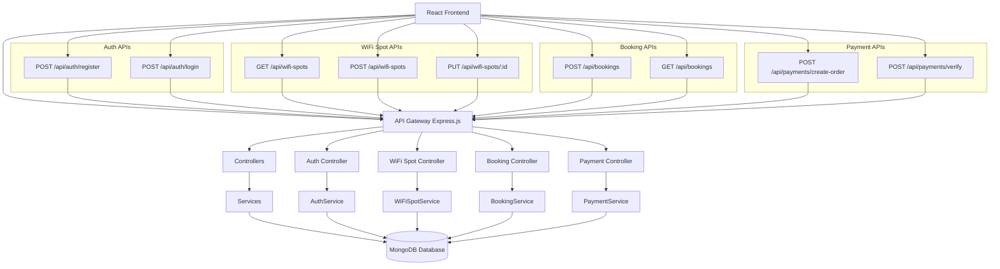

```mermaid
flowchart TD
    React[React Frontend]
    APIGateway[API Gateway Express.js]
    Controllers[Controllers]
    Services[Services]
    MongoDB[(MongoDB Database)]

    React --> APIGateway
    APIGateway --> Controllers
    Controllers --> Services
    Services --> MongoDB

    subgraph Auth APIs
        Register[POST /api/auth/register]
        Login[POST /api/auth/login]
    end
    subgraph WiFi Spot APIs
        GetSpots[GET /api/wifi-spots]
        CreateSpot[POST /api/wifi-spots]
        UpdateSpot[PUT /api/wifi-spots/:id]
    end
    subgraph Booking APIs
        CreateBooking[POST /api/bookings]
        GetBookings[GET /api/bookings]
    end
    subgraph Payment APIs
        CreateOrder[POST /api/payments/create-order]
        VerifyPayment[POST /api/payments/verify]
    end

    React --> Register
    React --> Login
    React --> GetSpots
    React --> CreateSpot
    React --> UpdateSpot
    React --> CreateBooking
    React --> GetBookings
    React --> CreateOrder
    React --> VerifyPayment

    Register --> APIGateway
    Login --> APIGateway
    GetSpots --> APIGateway
    CreateSpot --> APIGateway
    UpdateSpot --> APIGateway
    CreateBooking --> APIGateway
    GetBookings --> APIGateway
    CreateOrder --> APIGateway
    VerifyPayment --> APIGateway

    %% API Gateway routes to Controllers
    APIGateway --> AuthController[Auth Controller]
    APIGateway --> WiFiSpotController[WiFi Spot Controller]
    APIGateway --> BookingController[Booking Controller]
    APIGateway --> PaymentController[Payment Controller]

    %% Controllers to Services
    AuthController --> AuthService
    WiFiSpotController --> WiFiSpotService
    BookingController --> BookingService
    PaymentController --> PaymentService

    %% Services to MongoDB
    AuthService --> MongoDB
    WiFiSpotService --> MongoDB
    BookingService --> MongoDB
    PaymentService --> MongoDB
```