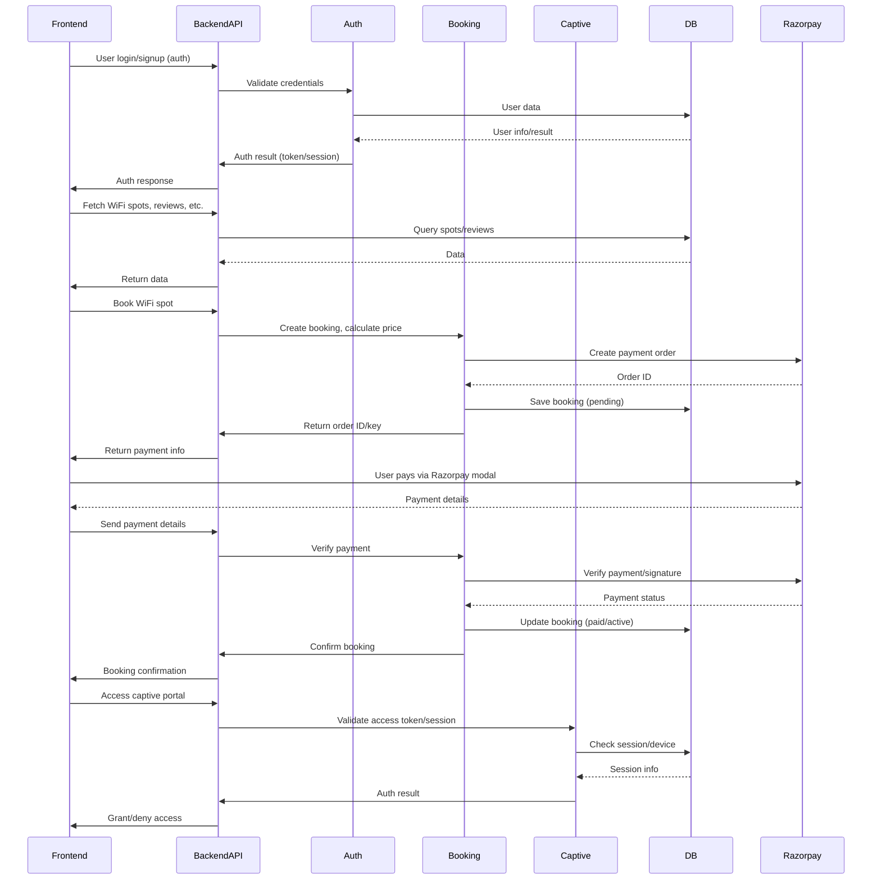

```mermaid

sequenceDiagram
    participant Frontend
    participant BackendAPI
    participant Auth
    participant Booking
    participant Captive
    participant DB
    participant Razorpay

    Frontend->>BackendAPI: User login/signup (auth)
    BackendAPI->>Auth: Validate credentials
    Auth->>DB: User data
    DB-->>Auth: User info/result
    Auth->>BackendAPI: Auth result (token/session)
    BackendAPI->>Frontend: Auth response

    Frontend->>BackendAPI: Fetch WiFi spots, reviews, etc.
    BackendAPI->>DB: Query spots/reviews
    DB-->>BackendAPI: Data
    BackendAPI->>Frontend: Return data

    Frontend->>BackendAPI: Book WiFi spot
    BackendAPI->>Booking: Create booking, calculate price
    Booking->>Razorpay: Create payment order
    Razorpay-->>Booking: Order ID
    Booking->>DB: Save booking (pending)
    Booking->>BackendAPI: Return order ID/key
    BackendAPI->>Frontend: Return payment info

    Frontend->>Razorpay: User pays via Razorpay modal
    Razorpay-->>Frontend: Payment details
    Frontend->>BackendAPI: Send payment details
    BackendAPI->>Booking: Verify payment
    Booking->>Razorpay: Verify payment/signature
    Razorpay-->>Booking: Payment status
    Booking->>DB: Update booking (paid/active)
    Booking->>BackendAPI: Confirm booking
    BackendAPI->>Frontend: Booking confirmation

    Frontend->>BackendAPI: Access captive portal
    BackendAPI->>Captive: Validate access token/session
    Captive->>DB: Check session/device
    DB-->>Captive: Session info
    Captive->>BackendAPI: Auth result
    BackendAPI->>Frontend: Grant/deny access
```