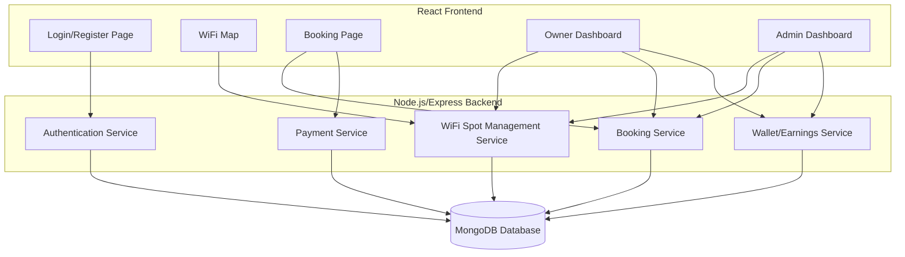

```mermaid
flowchart TD
    subgraph Frontend [React Frontend]
        Login[Login/Register Page]
        Map[WiFi Map]
        Booking[Booking Page]
        OwnerDash[Owner Dashboard]
        AdminDash[Admin Dashboard]
    end

    subgraph Backend [Node.js/Express Backend]
        AuthSvc[Authentication Service]
        SpotSvc[WiFi Spot Management Service]
        BookSvc[Booking Service]
        PaySvc[Payment Service]
        WalletSvc[Wallet/Earnings Service]
    end

    DB[(MongoDB Database)]

    %% Frontend to Backend REST API
    Login --> AuthSvc
    Map --> SpotSvc
    Booking --> BookSvc
    OwnerDash --> SpotSvc
    OwnerDash --> BookSvc
    OwnerDash --> WalletSvc
    AdminDash --> SpotSvc
    AdminDash --> BookSvc
    AdminDash --> WalletSvc
    Booking --> PaySvc

    %% Backend to DB
    AuthSvc --> DB
    SpotSvc --> DB
    BookSvc --> DB
    PaySvc --> DB
    WalletSvc --> DB
```