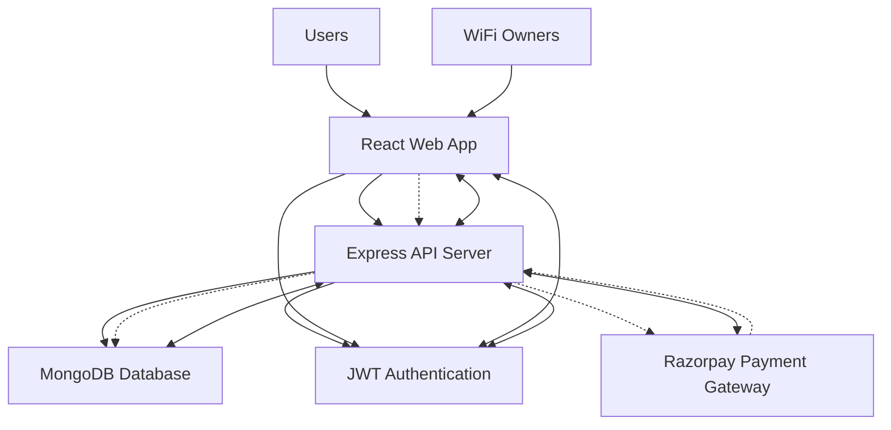

```mermaid
flowchart TD
    Users[Users]
    Owners[WiFi Owners]
    Frontend[React Web App]
    Backend[Express API Server]
    DB[MongoDB Database]
    Razorpay[Razorpay Payment Gateway]
    JWT[JWT Authentication]

    Users --> Frontend
    Owners --> Frontend
    Frontend --> Backend
    Backend --> DB
    Backend --> JWT
    Frontend --> JWT

    %% Payment Flow
    Frontend -.-> Backend
    Backend -.-> Razorpay
    Razorpay -.-> Backend
    Backend -.-> DB

    %% Communication arrows
    Frontend <--> Backend
    Backend <--> DB
    Backend <--> Razorpay
    Frontend <--> JWT
    Backend <--> JWT
```